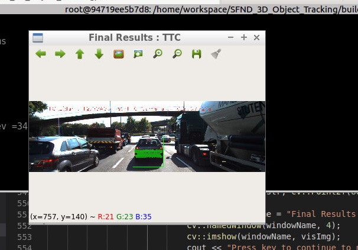
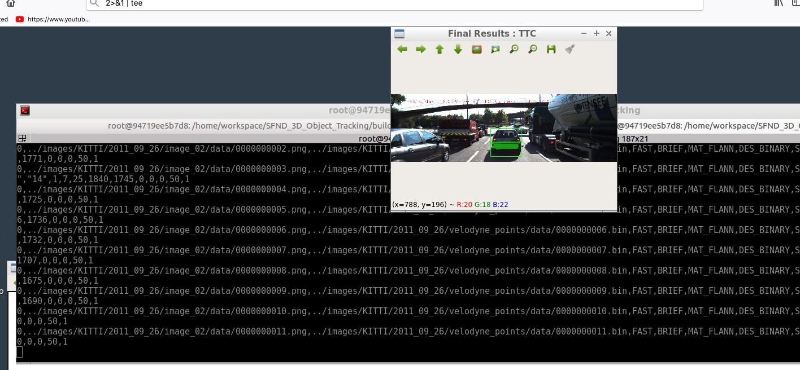
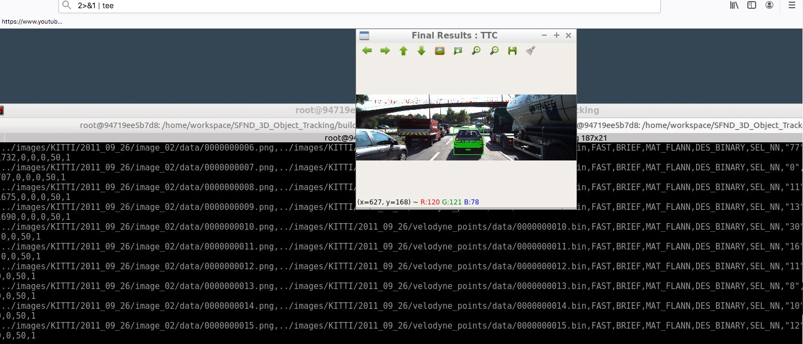

# SFND 3D Object Tracking

Welcome to the final project of the camera course. By completing all the lessons, you now have a solid understanding of keypoint detectors, descriptors, and methods to match them between successive images. Also, you know how to detect objects in an image using the YOLO deep-learning framework. And finally, you know how to associate regions in a camera image with Lidar points in 3D space. Let's take a look at our program schematic to see what we already have accomplished and what's still missing.


In this final project, you will implement the missing parts in the schematic. To do this, you will complete four major tasks: 
1. First, you will develop a way to match 3D objects over time by using keypoint correspondences. 
2. Second, you will compute the TTC based on Lidar measurements. 
3. You will then proceed to do the same using the camera, which requires to first associate keypoint matches to regions of interest and then to compute the TTC based on those matches. 
4. And lastly, you will conduct various tests with the framework. Your goal is to identify the most suitable detector/descriptor combination for TTC estimation and also to search for problems that can lead to faulty measurements by the camera or Lidar sensor. In the last course of this Nanodegree, you will learn about the Kalman filter, which is a great way to combine the two independent TTC measurements into an improved version which is much more reliable than a single sensor alone can be. But before we think about such things, let us focus on your final project in the camera course. 

## Dependencies for Running Locally
* cmake >= 2.8
  * All OSes: [click here for installation instructions](https://cmake.org/install/)
* make >= 4.1 (Linux, Mac), 3.81 (Windows)
  * Linux: make is installed by default on most Linux distros
  * Mac: [install Xcode command line tools to get make](https://developer.apple.com/xcode/features/)
  * Windows: [Click here for installation instructions](http://gnuwin32.sourceforge.net/packages/make.htm)
* Git LFS
  * Weight files are handled using [LFS](https://git-lfs.github.com/)
* OpenCV >= 4.1
  * This must be compiled from source using the `-D OPENCV_ENABLE_NONFREE=ON` cmake flag for testing the SIFT and SURF detectors.
  * The OpenCV 4.1.0 source code can be found [here](https://github.com/opencv/opencv/tree/4.1.0)
* gcc/g++ >= 5.4
  * Linux: gcc / g++ is installed by default on most Linux distros
  * Mac: same deal as make - [install Xcode command line tools](https://developer.apple.com/xcode/features/)
  * Windows: recommend using [MinGW](http://www.mingw.org/)

## Basic Build Instructions

1. Clone this repo.
2. Make a build directory in the top level project directory: `mkdir build && cd build`
3. Compile: `cmake .. && make`
4. Run it: `./3D_object_tracking`.


## Code


## Benchmark

### audit log :  collect every experiment's data
* Added new code to capture KPI, metrics from various experiments (with combinations of alogrithms detectors, descriptors and match algorithms).
* Used 'struct' to keep track of experiments - Config2DFeatTrack and AuditLog 
    ```c++  
        
        //struct to hold experiment's configuration
        struct Config3DObjectTrack {
            std::string detectorType = "SHITOMASI";
            std::string descriptorType = "BRISK"; // BRIEF, ORB, FREAK, AKAZE, SIFT
        
            std::string matcherType = "MAT_BF";        // MAT_BF, MAT_FLANN
            std::string matcherTypeMetric = "DES_BINARY"; // DES_BINARY, DES_HOG
            std::string matcherTypeSelector = "SEL_NN";       // SEL_NN, SEL_KNN
        
            bool bVis = false;
            bool bLimitKpts = false;
            int maxKeypoints = 50;
        
            bool bVisshow3DObjects= false;
            bool bWait3DObjects= false;
        
            bool bVisTTC= false;
        
        };
        
        //struct to hold experiment's audit log
        struct AuditLog {
            Config3DObjectTrack config ;
            std::string image_name ="";
            std::string lidar_file_name ="";
            std::vector<long> ttc_camera;
            std::vector<long> ttc_lidar;
        
            bool isError = false;
            long match_time = 0;
            long match_keypoints_size = 0;
            long match_removed_keypoints_size = 0;
            long desc_time  = 0;
            long detect_time = 0;
            long detect_keypoints_size = 0;
        };
       
        
   ```
* Now dynamically create a array of Config2DFeatTrack - combinations of algorithms.
    there 3 choices depending on how many test case you want to run.
    
    ```c++
        
  
        //choose single with visualization
       Config3DObjectTrack getConfigListSingle(int use_test=1) {
           //int use_test = 1;
           vector<Config3DObjectTrack> configList;
           Config3DObjectTrack config;
           if (use_test == 1)
           {
               config.detectorType = "SHITOMASI";
               config.descriptorType = "BRIEF";
               config.matcherType = "MAT_FLANN";
               config.matcherTypeMetric = "DES_BINARY";
               config.matcherTypeSelector = "SEL_NN";
           }
           else if (use_test == 2)
           {
               config.detectorType = "AKAZE";
               config.descriptorType = "FREAK";
               config.matcherType = "MAT_FLANN";
               config.matcherTypeMetric = "DES_BINARY";
               config.matcherTypeSelector = "SEL_NN";
           }
           else if (use_test == 3)
           {
               config.detectorType = "SHITOMASI";
               config.descriptorType = "ORB";
               config.matcherType = "MAT_BF";
               config.matcherTypeMetric = "DES_BINARY";
               config.matcherTypeSelector = "SEL_NN";
           }
           else if (use_test == 4)
           {
               config.detectorType = "ORB";
               config.descriptorType = "ORB";
               config.matcherType = "MAT_BF";
               config.matcherTypeMetric = "DES_BINARY";
               config.matcherTypeSelector = "SEL_NN";
           }
           config.bVis = false;
           config.bLimitKpts = false;
           config.maxKeypoints = 50;
           config.bVisshow3DObjects = false;
           config.bWait3DObjects = false;
           config.bVisTTC = false;
           config.bSaveImg = true;
       
           return config;
       }
       
       vector<Config3DObjectTrack> getConfigListShort() {
           vector<Config3DObjectTrack> configList;
           vector<string> detectorTypes = { "FAST", "BRISK", "ORB", "AKAZE","SHITOMASI", "HARRIS", "SIFT"};
           vector<string> descriptorTypes = {"BRISK", "BRIEF", "ORB", "FREAK"};
       
           vector<string> matcherTypes = { "MAT_FLANN"};
           vector<string> matcherTypeMetrics = {"DES_BINARY"};
           vector<string> matcherTypeSelectors = {"SEL_KNN"};
           for (auto  descriptorType:descriptorTypes) {
               bool write_detector = false;
       
               for (auto detectorType:detectorTypes) // start
               {
                   for (auto matcherType:matcherTypes) {
                       for (auto matcherTypeMetric:matcherTypeMetrics) {
                           for (auto matcherTypeSelector:matcherTypeSelectors) {
                               Config3DObjectTrack config;
                               config.detectorType = detectorType;
                               config.descriptorType = descriptorType;
                               config.matcherType = matcherType;
                               config.matcherTypeMetric = matcherTypeMetric;
                               config.matcherTypeSelector = matcherTypeSelector;
       
                               configList.push_back(config);
                           }
                       }
                   }
               }
           }
           return configList;
       }
       
       vector<Config3DObjectTrack> getConfigListAll() {
       
           vector<Config3DObjectTrack> configList;
           //vector<string> detectorTypes = {"SHITOMASI", "HARRIS", "FAST", "BRISK", "ORB", "AKAZE", "SIFT"};
           vector<string> detectorTypes = { "FAST", "BRISK", "ORB", "AKAZE","SHITOMASI", "HARRIS", "SIFT"};
           vector<string> descriptorTypes = {"BRISK", "BRIEF", "ORB", "FREAK", "AKAZE", "SIFT"};
       
           vector<string> matcherTypes = {"MAT_BF", "MAT_FLANN"};
           vector<string> matcherTypeMetrics = {"DES_BINARY", "DES_HOG"};
           vector<string> matcherTypeSelectors = {"SEL_NN", "SEL_KNN"};
           for (auto detectorType:detectorTypes) {
               bool write_detector = false; 
               for (auto descriptorType:descriptorTypes) // start
               { 
                   for (auto matcherType:matcherTypes) {
                       for (auto matcherTypeMetric:matcherTypeMetrics) {
                           for (auto matcherTypeSelector:matcherTypeSelectors) {
                               Config3DObjectTrack config;
                               config.detectorType = detectorType;
                               config.descriptorType = descriptorType;
                               config.matcherType = matcherType;
                               config.matcherTypeMetric = matcherTypeMetric;
                               config.matcherTypeSelector = matcherTypeSelector;
       
                               configList.push_back(config);
                           }
                       }
                   }
               }
           }
           return configList;
       }


        ...
        ...

     ```
 * To run all combinations of algorithms or one set of algorithm. 
    choose one of the 3 configuration initialization.
    Please change 'singleTest' in 'MidTermProject_Camera_Student.cpp -> main'. or 
    pass single argument  = single/short/all
    ```c++
       //'MidTermProject_Camera_Student.cpp -> main'
       // use singleTest &  singleTestConfig for one experiment
           bool singleTest = true;
           bool singleTestConfig = 2; //change to use other single test
           bool shortTest = false;
           string file_prefix = "short";
           //if argument is passed should be = single/short/all
           if (argc > 0 ) {
               if(argv[0] == "single"){
                   singleTest = true;
               }
               if(argv[0] == "short"){
                   singleTest = false;
                   shortTest = true;
               }
               if(argv[0] == "all"){
                   singleTest = false;
                   shortTest = false;
               }
           }
           // load configuration
           vector<Config3DObjectTrack> configList;  //shortTest=true/false . run all combination of all or shorter list
           Dif(singleTest){
                configList.push_back(getConfigListSingle(1));
                configList.push_back(getConfigListSingle(2));
                configList.push_back(getConfigListSingle(3));
                configList.push_back(getConfigListSingle(4));
                //configList.push_back(getConfigListSingle(5)); //default
                file_prefix = "one";
            }
            else if(shortTest)
            {
                configList = getConfigListShort();
                file_prefix = "short";
            }
            else
            {
                configList = getConfigListAll();
                file_prefix = "all";
            }
 
       ```
   
 * output of log outputed into three files
    
    run_test_all.log
    
    results.csv
    ``` 
          error,image_name,lidar_file_name,detectorType,descriptorType,matcherType,matcherTypeMetric,matcherTypeSelector,ttc_camera,ttc_lidar,detect_time,desc_time,match_time,detect_keypoints_size,match_keypoints_size,match_removed_keypoints_size,bVis,bLimitKpts,maxKeypoints,bVisshow3DObjects
          0,../images/KITTI/2011_09_26/image_02/data/0000000000.png,../images/KITTI/2011_09_26/velodyne_points/data/0000000000.bin,FAST,BRISK,MAT_BF,DES_BINARY,SEL_NN,"","",1,346,0,1864,0,0,0,0,50,0
          0,../images/KITTI/2011_09_26/image_02/data/0000000001.png,../images/KITTI/2011_09_26/velodyne_points/data/0000000001.bin,FAST,BRISK,MAT_BF,DES_BINARY,SEL_NN,"-9223372036854775808","12",1,325,40,1898,1806,0,0,0,50,0
          0,../images/KITTI/2011_09_26/image_02/data/0000000002.png,../images/KITTI/2011_09_26/velodyne_points/data/0000000002.bin,FAST,BRISK,MAT_BF,DES_BINARY,SEL_NN,"-21","12",1,335,36,1865,1841,0,0,0,50,0
           ...
          0,../images/KITTI/2011_09_26/image_02/data/0000000016.png,../images/KITTI/2011_09_26/velodyne_points/data/0000000016.bin,FAST,BRISK,MAT_FLANN,DES_BINARY,SEL_NN,"11","9",0,322,31,1934,1871,0,0,0,50,0
          0,../images/KITTI/2011_09_26/image_02/data/0000000017.png,../images/KITTI/2011_09_26/velodyne_points/data/0000000017.bin,FAST,BRISK,MAT_FLANN,DES_BINARY,SEL_NN,"0","9",1,323,31,1946,1877,0,0,0,50,0
          0,../images/KITTI/2011_09_26/image_02/data/0000000018.png,../images/KITTI/2011_09_26/velodyne_points/data/0000000018.bin,FAST,BRISK,MAT_FLANN,DES_BINARY,SEL_NN,"0","8",1,325,31,1961,1872,0,0,0,50,0
          0,../images/KITTI/2011_09_26/image_02/data/0000000000.png,../images/KITTI/2011_09_26/velodyne_points/data/0000000000.bin,FAST,BRISK,MAT_FLANN,DES_BINARY,SEL_KNN,"","",1,325,0,1864,0,0,0,0,50,0
  ...
     
    ```
     results.json
    ```
           [
               ...
              {
              'isError':'0',
              'image_name':'../images/KITTI/2011_09_26/image_02/data/0000000000.png',
              'lidar_file_name':'../images/KITTI/2011_09_26/velodyne_points/data/0000000000.bin',
              'detectorType':'FAST',
              'descriptorType':'BRISK',
              'matcherType':'MAT_BF',
              'ttc_camera':'',
              'ttc_lidar':'',
              'matcherTypeMetric':'DES_BINARY',
              'matcherTypeSelector':'SEL_NN',
              'detect_time_ms':1,
              'desc_time_ms':346,
              'match_time_ms':0,
              'detect_keypoints_size':1864,
              'match_keypoints_size':0,
              'match_removed_keypoints_size':0,
              'bVis':0,
              'bLimitKpts':0,
              'maxKeypoints':50,
              'bVisshow3DObjects':0,
              },
              
              ...
           ]
    ``` 
 
## Solution - SFND 3D Object Tracking 
### FP.1 Match 3D Objects
* Code is functional and returns the specified output, where each bounding box is assigned the match candidate 
    with the highest number of occurrences.
* Implementation: given prev and current bounding boxes, return thresholded boxIds with mactching ROI in both bounding boxes.
    ``` c++
          void matchBoundingBoxes (std::vector<cv::DMatch> &matches, std::map<int, int> &bbBestMatches, DataFrame &prevFrame, DataFrame &currFrame, Config3DObjectTrack &config3d, AuditLog &audit)
          {
              int threshold = 25;//100;
              int max=0;
              std::map<vector<int>, int>   matchedPairMultimap;
              for (auto curIt = currFrame.boundingBoxes.begin(); curIt != currFrame.boundingBoxes.end(); ++curIt)
              {
                  for (auto prevIt = prevFrame.boundingBoxes.begin(); prevIt != prevFrame.boundingBoxes.end(); ++prevIt )
                  {
                      for (auto matchIt = matches.begin(); matchIt != matches.end(); ++matchIt)
                      {
                          //if match is on within boundingBoxes or both prev and cuurent. increment count
                          bool matrchInCurrFrame = (curIt->roi.contains(currFrame.keypoints[matchIt->trainIdx].pt));
                          bool matrchInPrevFrame =  (prevIt->roi.contains(prevFrame.keypoints[matchIt->queryIdx].pt)) ;
                          if(matrchInCurrFrame && matrchInPrevFrame)
                          {
                              vector<int> pair_boxids {prevIt->boxID, curIt->boxID} ;
                              matchedPairMultimap[pair_boxids]++;
                          }
                      }
                  }
              }
              for(auto &matchedPair: matchedPairMultimap)
              {
                  //if count is above threshold, we will use it
                  if ( matchedPair.second >  threshold){
                      bbBestMatches.insert(std::pair<int, int>( matchedPair.first[0],  matchedPair.first[1]));
                      max++;
                  }
              }
          }

 
    ``` 
 
### FP.2 Compute Lidar-based TTC 
* Code is functional and returns the specified output. Also, the code is able to deal with
 outlier Lidar points in a statistically robust way to avoid severe estimation errors. 

* Implementation: calulate TTC (Time To Collision) given lidar points, optimize to avoid outliers.
    ``` c++ 
            void computeTTCLidar(std::vector<LidarPoint> &lidarPointsPrev,
                                 std::vector<LidarPoint> &lidarPointsCurr, double frameRate, double &TTC, Config3DObjectTrack &config3d, AuditLog &audit)
            {
                double dT = 0.1;        // time between two measurements in seconds
                double laneWidth = 4.0; // assumed width of the ego lane
                double half_lane_width = laneWidth / 2.0;
                // find closest distance to Lidar points within ego lane
                double medianXPrev = 1e9, medianXCurr = 1e9;
  
                std::vector<double> roi_cur;
                for (auto it = lidarPointsCurr.begin(); it != lidarPointsCurr.end(); ++it)
                {
                    if (abs(it->y) <= half_lane_width)
                        roi_cur.push_back(it->x);
                }
            
                std::vector<double> roi_prev;
                for (auto it = lidarPointsPrev.begin(); it != lidarPointsPrev.end(); ++it)
                {
                    if (abs(it->y) <= half_lane_width)
                        roi_prev.push_back(it->x);
                }
 
                if (roi_prev.size() == 0 || roi_cur.size()==0 )
                {
                    TTC = NAN;
                    cout << "computeTTCLidar audit.ttc_lidar TTC  NAN " <<    endl;
                    return;
                }
            
                //use median to avoid outliers.
                std::sort(roi_prev.begin(), roi_prev.end());
                std::sort(roi_cur.begin(), roi_cur.end());
            
                long medIndexP = floor(roi_prev.size() / 2.0);
                medianXPrev = roi_prev.size() % 2 == 0 ? (roi_prev[medIndexP - 1] + roi_prev[medIndexP]) / 2.0 : roi_prev[medIndexP];
            
                long medIndexC = floor(roi_cur.size() / 2.0);
                medianXCurr = roi_cur.size() % 2 == 0 ? (roi_cur[medIndexC - 1] + roi_cur[medIndexC]) / 2.0 : roi_cur[medIndexC];
            
                cout << "computeTTCLidar roi_prev =" << roi_prev.size()  << " m=" << medianXCurr << " i=" << medIndexP;
                cout << " roi_prev =" << roi_prev.size()  << " m=" << medianXCurr << " i=" << medIndexC << endl;
                // compute TTC from both measurements
                TTC = medianXCurr * dT * 1.0 / (medianXPrev - medianXCurr);
            
                //audit
                audit.ttc_lidar = TTC;
                cout << "computeTTCLidar audit.ttc_lidar TTC  " << TTC   << endl;
            }
    ``` 
##FP.3 Associate Keypoint Correspondences with Bounding Boxes 
* Code performs as described and adds the keypoint correspondences to the "kptMatches" property of the respective bounding boxes. Also, outlier matches have been removed based on
the euclidean distance between them in relation to all the matches in the bounding box. 

* Implementation:  
   
   ``` c++
                   //use median to avoid outliers.
                   std::sort(roi_prev.begin(), roi_prev.end());
                   std::sort(roi_cur.begin(), roi_cur.end());
               
                   long medIndexP = floor(roi_prev.size() / 2.0);
                   medianXPrev = roi_prev.size() % 2 == 0 ? (roi_prev[medIndexP - 1] + roi_prev[medIndexP]) / 2.0 : roi_prev[medIndexP];
               
                   long medIndexC = floor(roi_cur.size() / 2.0);
                   medianXCurr = roi_cur.size() % 2 == 0 ? (roi_cur[medIndexC - 1] + roi_cur[medIndexC]) / 2.0 : roi_cur[medIndexC];
   
   ``` 

##FP.4 Compute Camera-based TTC 
*  Code is functional and returns the specified output. Also, the code is able to deal with outlier correspondences in
 a statistically robust way to avoid severe estimation errors.


* Implementation:  Compute time-to-collision (TTC) based on keypoint correspondences in successive images, avoid outliers
   
   ``` c++
           void computeTTCCamera(std::vector<cv::KeyPoint> &kptsPrev, std::vector<cv::KeyPoint> &kptsCurr,
                                  std::vector<cv::DMatch> kptMatches, double frameRate, double &TTC, Config3DObjectTrack &config3d, AuditLog &audit, cv::Mat *visImg)
            {
                // compute distance ratios between all matched keypoints
                vector<double> distRatios; // stores the distance ratios for all keypoints between curr. and prev. frame
                for (auto it1 = kptMatches.begin(); it1 != kptMatches.end() - 1; ++it1)
                { // outer kpt. loop
            
                    // get current keypoint and its matched partner in the prev. frame
                    cv::KeyPoint kpOuterCurr = kptsCurr.at(it1->trainIdx);
                    cv::KeyPoint kpOuterPrev = kptsPrev.at(it1->queryIdx);
            
                    for (auto it2 = kptMatches.begin() + 1; it2 != kptMatches.end(); ++it2)
                    { // inner kpt.-loop
            
                        double minDist = 100.0; // min. required distance
            
                        // get next keypoint and its matched partner in the prev. frame
                        cv::KeyPoint kpInnerCurr = kptsCurr.at(it2->trainIdx);
                        cv::KeyPoint kpInnerPrev = kptsPrev.at(it2->queryIdx);
            
                        // compute distances and distance ratios
                        double distCurr = cv::norm(kpOuterCurr.pt - kpInnerCurr.pt);
                        double distPrev = cv::norm(kpOuterPrev.pt - kpInnerPrev.pt);
            
                        if (distPrev > std::numeric_limits<double>::epsilon() && distCurr >= minDist)
                        { // avoid division by zero
                            double distRatio = distCurr / distPrev;
                            if (distRatio > 0.2 && distRatio < 5)
                                distRatios.push_back(distRatio);
                        }
                    } // eof inner loop over all matched kpts
                } // eof outer loop over all matched kpts
            
                // only continue if list of distance ratios is not empty
                if (distRatios.size() == 0)
                {
                    TTC = NAN;
                    cout << "computeTTCCamera audit.ttc_camera TTC  NAN "  << endl;
                    return;
                } 
                //use median to avoid outliers
                std::sort(distRatios.begin(), distRatios.end());
                long medIndex = floor(distRatios.size() / 2.0);
                double medDistRatio = distRatios.size() % 2 == 0 ? (distRatios[medIndex - 1] + distRatios[medIndex]) / 2.0 : distRatios[medIndex]; // compute median dist. ratio to remove outlier influence
            
                double dT = 1 * 1.0  / frameRate;
                TTC = -dT * 1.0 / (1 - medDistRatio);
                //audit
                audit.ttc_camera = TTC;
                cout << "computeTTCCamera audit.ttc_camera TTC   " << TTC  << endl;
                
            }
       
   
   ``` 

## FP.5 Performance Evaluation 1 
* Several examples (2-3) have been identified and described in detail. The assertion that the TTC is off has been based on manually estimating the distance to the
 rear of the preceding vehicle from a top view perspective of the Lidar points.
 
Observation: TTC Lidar increases evne though the vehicle in front is braking. 
### case 1 : AKAZE_FREAK_MAT_FLANN_SEL_KNN DES_BINARY DES_BINARY_0003 to 0004 

 
  
### case 2 :BRISK_BRISK_MAT_FLANN_SEL_KNN DES_BINARY_0003 to 0005 


   
### case 3 :BRISK_ORB_MAT_FLANN_SEL_KNN DES_BINARY_0002 to 0004
 
 
 


 ## FP.6 Performance Evaluation 2 
 * All detector / descriptor combinations implemented in previous chapters have been compared with regard to the TTC estimate 
 on a frame-by-frame basis. To facilitate comparison, a spreadsheet and graph should be used to represent the different TTCs. 
  
 Observation:   

### single run 1 (FAST,BRIEF,MAT_FLANN,DES_BINARY,SEL_NN) 

[one_results_1.csv](./one_results_1.csv)

[one_results_1.json](./one_results_1.json) 


 



### single run 2 (FAST,BRIEF,MAT_FLANN,DES_BINARY,SEL_NN)
[one_results_1.csv](./one_results_1.csv)
[one_results_1.json](./one_results_1.json)

[one_results_3.csv](./one_results_3.csv)
[one_results_3.json](./one_results_3.json)

### short run 1  
[short_results_1.csv](./short_results_1.csv)
[short_results_1.json](./short_results_1.json)

### short run 2  
[short_results_2.csv](./short_results_2.csv)
[short_results_2.json](./short_results_2.json) 
 
### short run 3  
[short_results_3.csv](./short_results_3.csv)
[short_results_3.json](./short_results_3.json) 
 
 
### all run ( have to stop it due to GPU usage) 
[results.csv](./results.csv)
[results.json](./results.json) 

 ## anylysis 
 * report_analysis.ipynb to peek into various csv files .  
 
 [report_analysis.md](./report_analysis.md)
 [report_analysis2.md](./report_analysis2.md)
  
 ## extract form  report_analysis.ipynb 
  
  

```python
import pandas as pd
import numpy as np
import os.path
```


```python
def get_image_name(path): 
    return os.path.basename(path)
```

best performers sorted by ttc_camera


```python
df = pd.read_csv("results.csv")
del df["matcherTypeSelector"]
del df["matcherTypeMetric"]
del df["matcherType"]
del df["error"]
df_orig2= df.groupby(['descriptorType', 'detectorType']).mean() 
df_orig2= df_orig2[df_orig2['ttc_lidar'] > 0 ] 
df_orig2= df_orig2[df_orig2['ttc_camera'] > 0 ] 
df_orig2 = df_orig2.sort_values(by=['ttc_camera'], ascending=[1])
df_orig2.head(1000)
```


<div>
<style scoped>
    .dataframe tbody tr th:only-of-type {
        vertical-align: middle;
    }

    .dataframe tbody tr th {
        vertical-align: top;
    }

    .dataframe thead th {
        text-align: right;
    }
</style>
<table border="1" class="dataframe">
  <thead>
    <tr style="text-align: right;">
      <th></th>
      <th></th>
      <th>ttc_camera</th>
      <th>ttc_lidar</th>
      <th>detect_time</th>
      <th>desc_time</th>
      <th>match_time</th>
      <th>detect_keypoints_size</th>
      <th>match_keypoints_size</th>
      <th>match_removed_keypoints_size</th>
      <th>bVis</th>
      <th>bLimitKpts</th>
      <th>maxKeypoints</th>
      <th>bVisshow3DObjects</th>
    </tr>
    <tr>
      <th>descriptorType</th>
      <th>detectorType</th>
      <th></th>
      <th></th>
      <th></th>
      <th></th>
      <th></th>
      <th></th>
      <th></th>
      <th></th>
      <th></th>
      <th></th>
      <th></th>
      <th></th>
    </tr>
  </thead>
  <tbody>
    <tr>
      <th>BRISK</th>
      <th>ORB</th>
      <td>11.825688</td>
      <td>11.333333</td>
      <td>7.486842</td>
      <td>318.388158</td>
      <td>3.388158</td>
      <td>500.000000</td>
      <td>329.519737</td>
      <td>51.480263</td>
      <td>0.0</td>
      <td>0.0</td>
      <td>50.0</td>
      <td>0.0</td>
    </tr>
    <tr>
      <th rowspan="2" valign="top">FREAK</th>
      <th>BRISK</th>
      <td>12.298611</td>
      <td>11.333333</td>
      <td>360.072368</td>
      <td>60.651316</td>
      <td>50.697368</td>
      <td>2983.526316</td>
      <td>1720.375000</td>
      <td>603.835526</td>
      <td>0.0</td>
      <td>0.0</td>
      <td>50.0</td>
      <td>0.0</td>
    </tr>
    <tr>
      <th>FAST</th>
      <td>13.388430</td>
      <td>11.333333</td>
      <td>0.756579</td>
      <td>53.809211</td>
      <td>29.190789</td>
      <td>1870.210526</td>
      <td>1177.131579</td>
      <td>472.763158</td>
      <td>0.0</td>
      <td>0.0</td>
      <td>50.0</td>
      <td>0.0</td>
    </tr>
    <tr>
      <th>SIFT</th>
      <th>FAST</th>
      <td>14.476190</td>
      <td>11.333333</td>
      <td>0.848684</td>
      <td>87.447368</td>
      <td>18.500000</td>
      <td>1870.210526</td>
      <td>778.000000</td>
      <td>105.500000</td>
      <td>0.0</td>
      <td>0.0</td>
      <td>50.0</td>
      <td>0.0</td>
    </tr>
    <tr>
      <th>BRISK</th>
      <th>BRISK</th>
      <td>17.140845</td>
      <td>11.267606</td>
      <td>358.940789</td>
      <td>344.032895</td>
      <td>70.907895</td>
      <td>2983.526316</td>
      <td>2061.605263</td>
      <td>756.342105</td>
      <td>0.0</td>
      <td>0.0</td>
      <td>50.0</td>
      <td>0.0</td>
    </tr>
    <tr>
      <th>ORB</th>
      <th>BRISK</th>
      <td>33.885496</td>
      <td>11.266667</td>
      <td>365.144737</td>
      <td>8.743421</td>
      <td>61.907895</td>
      <td>2983.526316</td>
      <td>1929.493421</td>
      <td>836.980263</td>
      <td>0.0</td>
      <td>0.0</td>
      <td>50.0</td>
      <td>0.0</td>
    </tr>
    <tr>
      <th>BRISK</th>
      <th>FAST</th>
      <td>39.048780</td>
      <td>11.333333</td>
      <td>0.730263</td>
      <td>323.223684</td>
      <td>31.059211</td>
      <td>1870.210526</td>
      <td>1262.184211</td>
      <td>448.552632</td>
      <td>0.0</td>
      <td>0.0</td>
      <td>50.0</td>
      <td>0.0</td>
    </tr>
    <tr>
      <th>BRIEF</th>
      <th>FAST</th>
      <td>41.393162</td>
      <td>11.333333</td>
      <td>0.703947</td>
      <td>5.875000</td>
      <td>25.302632</td>
      <td>1870.210526</td>
      <td>1342.664474</td>
      <td>283.861842</td>
      <td>0.0</td>
      <td>0.0</td>
      <td>50.0</td>
      <td>0.0</td>
    </tr>
  </tbody>
</table>
</div>


```python
df_orig = pd.read_csv("results.csv")
df_orig = df_orig.dropna()
df_orig.head(5)
```


<div>
<style scoped>
    .dataframe tbody tr th:only-of-type {
        vertical-align: middle;
    }

    .dataframe tbody tr th {
        vertical-align: top;
    }

    .dataframe thead th {
        text-align: right;
    }
</style>
<table border="1" class="dataframe">
  <thead>
    <tr style="text-align: right;">
      <th></th>
      <th>error</th>
      <th>image_name</th>
      <th>lidar_file_name</th>
      <th>detectorType</th>
      <th>descriptorType</th>
      <th>matcherType</th>
      <th>matcherTypeMetric</th>
      <th>matcherTypeSelector</th>
      <th>ttc_camera</th>
      <th>ttc_lidar</th>
      <th>detect_time</th>
      <th>desc_time</th>
      <th>match_time</th>
      <th>detect_keypoints_size</th>
      <th>match_keypoints_size</th>
      <th>match_removed_keypoints_size</th>
      <th>bVis</th>
      <th>bLimitKpts</th>
      <th>maxKeypoints</th>
      <th>bVisshow3DObjects</th>
    </tr>
  </thead>
  <tbody>
    <tr>
      <th>2</th>
      <td>0</td>
      <td>../images/KITTI/2011_09_26/image_02/data/00000...</td>
      <td>../images/KITTI/2011_09_26/velodyne_points/dat...</td>
      <td>FAST</td>
      <td>BRISK</td>
      <td>MAT_BF</td>
      <td>DES_BINARY</td>
      <td>SEL_NN</td>
      <td>-21.0</td>
      <td>12.0</td>
      <td>1</td>
      <td>335</td>
      <td>36</td>
      <td>1865</td>
      <td>1841</td>
      <td>0</td>
      <td>0</td>
      <td>0</td>
      <td>50</td>
      <td>0</td>
    </tr>
    <tr>
      <th>3</th>
      <td>0</td>
      <td>../images/KITTI/2011_09_26/image_02/data/00000...</td>
      <td>../images/KITTI/2011_09_26/velodyne_points/dat...</td>
      <td>FAST</td>
      <td>BRISK</td>
      <td>MAT_BF</td>
      <td>DES_BINARY</td>
      <td>SEL_NN</td>
      <td>23.0</td>
      <td>14.0</td>
      <td>1</td>
      <td>321</td>
      <td>38</td>
      <td>1840</td>
      <td>1810</td>
      <td>0</td>
      <td>0</td>
      <td>0</td>
      <td>50</td>
      <td>0</td>
    </tr>
    <tr>
      <th>4</th>
      <td>0</td>
      <td>../images/KITTI/2011_09_26/image_02/data/00000...</td>
      <td>../images/KITTI/2011_09_26/velodyne_points/dat...</td>
      <td>FAST</td>
      <td>BRISK</td>
      <td>MAT_BF</td>
      <td>DES_BINARY</td>
      <td>SEL_NN</td>
      <td>-14.0</td>
      <td>16.0</td>
      <td>1</td>
      <td>330</td>
      <td>36</td>
      <td>1867</td>
      <td>1789</td>
      <td>0</td>
      <td>0</td>
      <td>0</td>
      <td>50</td>
      <td>0</td>
    </tr>
    <tr>
      <th>5</th>
      <td>0</td>
      <td>../images/KITTI/2011_09_26/image_02/data/00000...</td>
      <td>../images/KITTI/2011_09_26/velodyne_points/dat...</td>
      <td>FAST</td>
      <td>BRISK</td>
      <td>MAT_BF</td>
      <td>DES_BINARY</td>
      <td>SEL_NN</td>
      <td>10.0</td>
      <td>15.0</td>
      <td>0</td>
      <td>320</td>
      <td>38</td>
      <td>1876</td>
      <td>1819</td>
      <td>0</td>
      <td>0</td>
      <td>0</td>
      <td>50</td>
      <td>0</td>
    </tr>
    <tr>
      <th>6</th>
      <td>0</td>
      <td>../images/KITTI/2011_09_26/image_02/data/00000...</td>
      <td>../images/KITTI/2011_09_26/velodyne_points/dat...</td>
      <td>FAST</td>
      <td>BRISK</td>
      <td>MAT_BF</td>
      <td>DES_BINARY</td>
      <td>SEL_NN</td>
      <td>-7.0</td>
      <td>12.0</td>
      <td>1</td>
      <td>320</td>
      <td>35</td>
      <td>1843</td>
      <td>1823</td>
      <td>0</td>
      <td>0</td>
      <td>0</td>
      <td>50</td>
      <td>0</td>
    </tr>
  </tbody>
</table>
</div>


ttc_camera,  ttc_lidar


```python
df_orig = pd.read_csv("results.csv")
df_orig = df_orig.dropna()
# df_orig2=df_orig.sort_values(by=['error'], ascending=[0])
df_orig2 = df_orig[['error', 'detectorType', 'descriptorType', "matcherType", "matcherTypeMetric","matcherTypeSelector", "ttc_camera", "ttc_lidar", "detect_time", "desc_time"]]
# df_orig3= df_orig2[df_orig2['descriptorType'] == 'AKAZE'] 
df_orig2.drop_duplicates().head(1000)
 
```


<div>
<style scoped>
    .dataframe tbody tr th:only-of-type {
        vertical-align: middle;
    }

    .dataframe tbody tr th {
        vertical-align: top;
    }

    .dataframe thead th {
        text-align: right;
    }
</style>
<table border="1" class="dataframe">
  <thead>
    <tr style="text-align: right;">
      <th></th>
      <th>error</th>
      <th>detectorType</th>
      <th>descriptorType</th>
      <th>matcherType</th>
      <th>matcherTypeMetric</th>
      <th>matcherTypeSelector</th>
      <th>ttc_camera</th>
      <th>ttc_lidar</th>
      <th>detect_time</th>
      <th>desc_time</th>
    </tr>
  </thead>
  <tbody>
    <tr>
      <th>2</th>
      <td>0</td>
      <td>FAST</td>
      <td>BRISK</td>
      <td>MAT_BF</td>
      <td>DES_BINARY</td>
      <td>SEL_NN</td>
      <td>-21.0</td>
      <td>12.0</td>
      <td>1</td>
      <td>335</td>
    </tr>
    <tr>
      <th>3</th>
      <td>0</td>
      <td>FAST</td>
      <td>BRISK</td>
      <td>MAT_BF</td>
      <td>DES_BINARY</td>
      <td>SEL_NN</td>
      <td>23.0</td>
      <td>14.0</td>
      <td>1</td>
      <td>321</td>
    </tr>
    <tr>
      <th>4</th>
      <td>0</td>
      <td>FAST</td>
      <td>BRISK</td>
      <td>MAT_BF</td>
      <td>DES_BINARY</td>
      <td>SEL_NN</td>
      <td>-14.0</td>
      <td>16.0</td>
      <td>1</td>
      <td>330</td>
    </tr>
    <tr>
      <th>5</th>
      <td>0</td>
      <td>FAST</td>
      <td>BRISK</td>
      <td>MAT_BF</td>
      <td>DES_BINARY</td>
      <td>SEL_NN</td>
      <td>10.0</td>
      <td>15.0</td>
      <td>0</td>
      <td>320</td>
    </tr>
    <tr>
      <th>6</th>
      <td>0</td>
      <td>FAST</td>
      <td>BRISK</td>
      <td>MAT_BF</td>
      <td>DES_BINARY</td>
      <td>SEL_NN</td>
      <td>-7.0</td>
      <td>12.0</td>
      <td>1</td>
      <td>320</td>
    </tr>
    <tr>
      <th>8</th>
      <td>0</td>
      <td>FAST</td>
      <td>BRISK</td>
      <td>MAT_BF</td>
      <td>DES_BINARY</td>
      <td>SEL_NN</td>
      <td>25.0</td>
      <td>13.0</td>
      <td>0</td>
      <td>320</td>
    </tr>
    <tr>
      <th>9</th>
      <td>0</td>
      <td>FAST</td>
      <td>BRISK</td>
      <td>MAT_BF</td>
      <td>DES_BINARY</td>
      <td>SEL_NN</td>
      <td>-25.0</td>
      <td>13.0</td>
      <td>1</td>
      <td>315</td>
    </tr>
    <tr>
      <th>10</th>
      <td>0</td>
      <td>FAST</td>
      <td>BRISK</td>
      <td>MAT_BF</td>
      <td>DES_BINARY</td>
      <td>SEL_NN</td>
      <td>2376.0</td>
      <td>11.0</td>
      <td>0</td>
      <td>323</td>
    </tr>
    <tr>
      <th>11</th>
      <td>0</td>
      <td>FAST</td>
      <td>BRISK</td>
      <td>MAT_BF</td>
      <td>DES_BINARY</td>
      <td>SEL_NN</td>
      <td>25.0</td>
      <td>12.0</td>
      <td>1</td>
      <td>312</td>
    </tr>
    <tr>
      <th>12</th>
      <td>0</td>
      <td>FAST</td>
      <td>BRISK</td>
      <td>MAT_BF</td>
      <td>DES_BINARY</td>
      <td>SEL_NN</td>
      <td>10.0</td>
      <td>9.0</td>
      <td>1</td>
      <td>318</td>
    </tr>
    <tr>
      <th>13</th>
      <td>0</td>
      <td>FAST</td>
      <td>BRISK</td>
      <td>MAT_BF</td>
      <td>DES_BINARY</td>
      <td>SEL_NN</td>
      <td>12.0</td>
      <td>10.0</td>
      <td>1</td>
      <td>320</td>
    </tr>
    <tr>
      <th>14</th>
      <td>0</td>
      <td>FAST</td>
      <td>BRISK</td>
      <td>MAT_BF</td>
      <td>DES_BINARY</td>
      <td>SEL_NN</td>
      <td>15.0</td>
      <td>9.0</td>
      <td>0</td>
      <td>319</td>
    </tr>
    <tr>
      <th>15</th>
      <td>0</td>
      <td>FAST</td>
      <td>BRISK</td>
      <td>MAT_BF</td>
      <td>DES_BINARY</td>
      <td>SEL_NN</td>
      <td>9.0</td>
      <td>8.0</td>
      <td>1</td>
      <td>324</td>
    </tr>
    <tr>
      <th>17</th>
      <td>0</td>
      <td>FAST</td>
      <td>BRISK</td>
      <td>MAT_BF</td>
      <td>DES_BINARY</td>
      <td>SEL_NN</td>
      <td>12.0</td>
      <td>9.0</td>
      <td>0</td>
      <td>325</td>
    </tr>
    <tr>
      <th>18</th>
      <td>0</td>
      <td>FAST</td>
      <td>BRISK</td>
      <td>MAT_BF</td>
      <td>DES_BINARY</td>
      <td>SEL_NN</td>
      <td>0.0</td>
      <td>8.0</td>
      <td>1</td>
      <td>321</td>
    </tr>
    <tr>
      <th>21</th>
      <td>0</td>
      <td>FAST</td>
      <td>BRISK</td>
      <td>MAT_BF</td>
      <td>DES_BINARY</td>
      <td>SEL_KNN</td>
      <td>37.0</td>
      <td>12.0</td>
      <td>1</td>
      <td>316</td>
    </tr>
    <tr>
      <th>22</th>
      <td>0</td>
      <td>FAST</td>
      <td>BRISK</td>
      <td>MAT_BF</td>
      <td>DES_BINARY</td>
      <td>SEL_KNN</td>
      <td>20.0</td>
      <td>14.0</td>
      <td>0</td>
      <td>334</td>
    </tr>
    <tr>
      <th>23</th>
      <td>0</td>
      <td>FAST</td>
      <td>BRISK</td>
      <td>MAT_BF</td>
      <td>DES_BINARY</td>
      <td>SEL_KNN</td>
      <td>13.0</td>
      <td>16.0</td>
      <td>1</td>
      <td>321</td>
    </tr>
    <tr>
      <th>25</th>
      <td>0</td>
      <td>FAST</td>
      <td>BRISK</td>
      <td>MAT_BF</td>
      <td>DES_BINARY</td>
      <td>SEL_KNN</td>
      <td>175.0</td>
      <td>12.0</td>
      <td>1</td>
      <td>324</td>
    </tr>
    <tr>
      <th>26</th>
      <td>0</td>
      <td>FAST</td>
      <td>BRISK</td>
      <td>MAT_BF</td>
      <td>DES_BINARY</td>
      <td>SEL_KNN</td>
      <td>18.0</td>
      <td>12.0</td>
      <td>1</td>
      <td>319</td>
    </tr>
    <tr>
      <th>27</th>
      <td>0</td>
      <td>FAST</td>
      <td>BRISK</td>
      <td>MAT_BF</td>
      <td>DES_BINARY</td>
      <td>SEL_KNN</td>
      <td>11.0</td>
      <td>13.0</td>
      <td>1</td>
      <td>321</td>
    </tr>
    <tr>
      <th>28</th>
      <td>0</td>
      <td>FAST</td>
      <td>BRISK</td>
      <td>MAT_BF</td>
      <td>DES_BINARY</td>
      <td>SEL_KNN</td>
      <td>12.0</td>
      <td>13.0</td>
      <td>1</td>
      <td>319</td>
    </tr>
    <tr>
      <th>29</th>
      <td>0</td>
      <td>FAST</td>
      <td>BRISK</td>
      <td>MAT_BF</td>
      <td>DES_BINARY</td>
      <td>SEL_KNN</td>
      <td>13.0</td>
      <td>11.0</td>
      <td>1</td>
      <td>317</td>
    </tr>
    <tr>
      <th>30</th>
      <td>0</td>
      <td>FAST</td>
      <td>BRISK</td>
      <td>MAT_BF</td>
      <td>DES_BINARY</td>
      <td>SEL_KNN</td>
      <td>54.0</td>
      <td>12.0</td>
      <td>1</td>
      <td>321</td>
    </tr>
    <tr>
      <th>31</th>
      <td>0</td>
      <td>FAST</td>
      <td>BRISK</td>
      <td>MAT_BF</td>
      <td>DES_BINARY</td>
      <td>SEL_KNN</td>
      <td>11.0</td>
      <td>9.0</td>
      <td>1</td>
      <td>318</td>
    </tr>
    <tr>
      <th>32</th>
      <td>0</td>
      <td>FAST</td>
      <td>BRISK</td>
      <td>MAT_BF</td>
      <td>DES_BINARY</td>
      <td>SEL_KNN</td>
      <td>11.0</td>
      <td>10.0</td>
      <td>1</td>
      <td>326</td>
    </tr>
    <tr>
      <th>33</th>
      <td>0</td>
      <td>FAST</td>
      <td>BRISK</td>
      <td>MAT_BF</td>
      <td>DES_BINARY</td>
      <td>SEL_KNN</td>
      <td>11.0</td>
      <td>9.0</td>
      <td>1</td>
      <td>317</td>
    </tr>
    <tr>
      <th>34</th>
      <td>0</td>
      <td>FAST</td>
      <td>BRISK</td>
      <td>MAT_BF</td>
      <td>DES_BINARY</td>
      <td>SEL_KNN</td>
      <td>10.0</td>
      <td>8.0</td>
      <td>1</td>
      <td>325</td>
    </tr>
    <tr>
      <th>35</th>
      <td>0</td>
      <td>FAST</td>
      <td>BRISK</td>
      <td>MAT_BF</td>
      <td>DES_BINARY</td>
      <td>SEL_KNN</td>
      <td>90.0</td>
      <td>9.0</td>
      <td>1</td>
      <td>321</td>
    </tr>
    <tr>
      <th>36</th>
      <td>0</td>
      <td>FAST</td>
      <td>BRISK</td>
      <td>MAT_BF</td>
      <td>DES_BINARY</td>
      <td>SEL_KNN</td>
      <td>7.0</td>
      <td>9.0</td>
      <td>0</td>
      <td>322</td>
    </tr>
    <tr>
      <th>...</th>
      <td>...</td>
      <td>...</td>
      <td>...</td>
      <td>...</td>
      <td>...</td>
      <td>...</td>
      <td>...</td>
      <td>...</td>
      <td>...</td>
      <td>...</td>
    </tr>
    <tr>
      <th>1404</th>
      <td>0</td>
      <td>BRISK</td>
      <td>FREAK</td>
      <td>MAT_BF</td>
      <td>DES_BINARY</td>
      <td>SEL_KNN</td>
      <td>16.0</td>
      <td>9.0</td>
      <td>353</td>
      <td>59</td>
    </tr>
    <tr>
      <th>1405</th>
      <td>0</td>
      <td>BRISK</td>
      <td>FREAK</td>
      <td>MAT_BF</td>
      <td>DES_BINARY</td>
      <td>SEL_KNN</td>
      <td>7.0</td>
      <td>8.0</td>
      <td>348</td>
      <td>60</td>
    </tr>
    <tr>
      <th>1407</th>
      <td>0</td>
      <td>BRISK</td>
      <td>FREAK</td>
      <td>MAT_BF</td>
      <td>DES_HOG</td>
      <td>SEL_NN</td>
      <td>23.0</td>
      <td>12.0</td>
      <td>370</td>
      <td>62</td>
    </tr>
    <tr>
      <th>1408</th>
      <td>0</td>
      <td>BRISK</td>
      <td>FREAK</td>
      <td>MAT_BF</td>
      <td>DES_HOG</td>
      <td>SEL_NN</td>
      <td>-22.0</td>
      <td>12.0</td>
      <td>345</td>
      <td>60</td>
    </tr>
    <tr>
      <th>1409</th>
      <td>0</td>
      <td>BRISK</td>
      <td>FREAK</td>
      <td>MAT_BF</td>
      <td>DES_HOG</td>
      <td>SEL_NN</td>
      <td>33.0</td>
      <td>14.0</td>
      <td>346</td>
      <td>59</td>
    </tr>
    <tr>
      <th>1410</th>
      <td>0</td>
      <td>BRISK</td>
      <td>FREAK</td>
      <td>MAT_BF</td>
      <td>DES_HOG</td>
      <td>SEL_NN</td>
      <td>13.0</td>
      <td>16.0</td>
      <td>360</td>
      <td>60</td>
    </tr>
    <tr>
      <th>1411</th>
      <td>0</td>
      <td>BRISK</td>
      <td>FREAK</td>
      <td>MAT_BF</td>
      <td>DES_HOG</td>
      <td>SEL_NN</td>
      <td>49.0</td>
      <td>15.0</td>
      <td>360</td>
      <td>62</td>
    </tr>
    <tr>
      <th>1412</th>
      <td>0</td>
      <td>BRISK</td>
      <td>FREAK</td>
      <td>MAT_BF</td>
      <td>DES_HOG</td>
      <td>SEL_NN</td>
      <td>27.0</td>
      <td>12.0</td>
      <td>365</td>
      <td>61</td>
    </tr>
    <tr>
      <th>1413</th>
      <td>0</td>
      <td>BRISK</td>
      <td>FREAK</td>
      <td>MAT_BF</td>
      <td>DES_HOG</td>
      <td>SEL_NN</td>
      <td>90.0</td>
      <td>12.0</td>
      <td>370</td>
      <td>62</td>
    </tr>
    <tr>
      <th>1414</th>
      <td>0</td>
      <td>BRISK</td>
      <td>FREAK</td>
      <td>MAT_BF</td>
      <td>DES_HOG</td>
      <td>SEL_NN</td>
      <td>18.0</td>
      <td>13.0</td>
      <td>342</td>
      <td>58</td>
    </tr>
    <tr>
      <th>1415</th>
      <td>0</td>
      <td>BRISK</td>
      <td>FREAK</td>
      <td>MAT_BF</td>
      <td>DES_HOG</td>
      <td>SEL_NN</td>
      <td>13.0</td>
      <td>13.0</td>
      <td>348</td>
      <td>60</td>
    </tr>
    <tr>
      <th>1416</th>
      <td>0</td>
      <td>BRISK</td>
      <td>FREAK</td>
      <td>MAT_BF</td>
      <td>DES_HOG</td>
      <td>SEL_NN</td>
      <td>186.0</td>
      <td>11.0</td>
      <td>352</td>
      <td>60</td>
    </tr>
    <tr>
      <th>1417</th>
      <td>0</td>
      <td>BRISK</td>
      <td>FREAK</td>
      <td>MAT_BF</td>
      <td>DES_HOG</td>
      <td>SEL_NN</td>
      <td>14.0</td>
      <td>12.0</td>
      <td>368</td>
      <td>61</td>
    </tr>
    <tr>
      <th>1418</th>
      <td>0</td>
      <td>BRISK</td>
      <td>FREAK</td>
      <td>MAT_BF</td>
      <td>DES_HOG</td>
      <td>SEL_NN</td>
      <td>10.0</td>
      <td>9.0</td>
      <td>368</td>
      <td>62</td>
    </tr>
    <tr>
      <th>1419</th>
      <td>0</td>
      <td>BRISK</td>
      <td>FREAK</td>
      <td>MAT_BF</td>
      <td>DES_HOG</td>
      <td>SEL_NN</td>
      <td>12.0</td>
      <td>10.0</td>
      <td>369</td>
      <td>62</td>
    </tr>
    <tr>
      <th>1420</th>
      <td>0</td>
      <td>BRISK</td>
      <td>FREAK</td>
      <td>MAT_BF</td>
      <td>DES_HOG</td>
      <td>SEL_NN</td>
      <td>6.0</td>
      <td>9.0</td>
      <td>369</td>
      <td>61</td>
    </tr>
    <tr>
      <th>1421</th>
      <td>0</td>
      <td>BRISK</td>
      <td>FREAK</td>
      <td>MAT_BF</td>
      <td>DES_HOG</td>
      <td>SEL_NN</td>
      <td>13.0</td>
      <td>8.0</td>
      <td>370</td>
      <td>63</td>
    </tr>
    <tr>
      <th>1422</th>
      <td>0</td>
      <td>BRISK</td>
      <td>FREAK</td>
      <td>MAT_BF</td>
      <td>DES_HOG</td>
      <td>SEL_NN</td>
      <td>18.0</td>
      <td>9.0</td>
      <td>372</td>
      <td>62</td>
    </tr>
    <tr>
      <th>1423</th>
      <td>0</td>
      <td>BRISK</td>
      <td>FREAK</td>
      <td>MAT_BF</td>
      <td>DES_HOG</td>
      <td>SEL_NN</td>
      <td>14.0</td>
      <td>9.0</td>
      <td>368</td>
      <td>61</td>
    </tr>
    <tr>
      <th>1424</th>
      <td>0</td>
      <td>BRISK</td>
      <td>FREAK</td>
      <td>MAT_BF</td>
      <td>DES_HOG</td>
      <td>SEL_NN</td>
      <td>24.0</td>
      <td>8.0</td>
      <td>352</td>
      <td>58</td>
    </tr>
    <tr>
      <th>1426</th>
      <td>0</td>
      <td>BRISK</td>
      <td>FREAK</td>
      <td>MAT_BF</td>
      <td>DES_HOG</td>
      <td>SEL_KNN</td>
      <td>21.0</td>
      <td>12.0</td>
      <td>367</td>
      <td>62</td>
    </tr>
    <tr>
      <th>1427</th>
      <td>0</td>
      <td>BRISK</td>
      <td>FREAK</td>
      <td>MAT_BF</td>
      <td>DES_HOG</td>
      <td>SEL_KNN</td>
      <td>456.0</td>
      <td>12.0</td>
      <td>363</td>
      <td>61</td>
    </tr>
    <tr>
      <th>1428</th>
      <td>0</td>
      <td>BRISK</td>
      <td>FREAK</td>
      <td>MAT_BF</td>
      <td>DES_HOG</td>
      <td>SEL_KNN</td>
      <td>18.0</td>
      <td>14.0</td>
      <td>366</td>
      <td>61</td>
    </tr>
    <tr>
      <th>1429</th>
      <td>0</td>
      <td>BRISK</td>
      <td>FREAK</td>
      <td>MAT_BF</td>
      <td>DES_HOG</td>
      <td>SEL_KNN</td>
      <td>9.0</td>
      <td>16.0</td>
      <td>362</td>
      <td>61</td>
    </tr>
    <tr>
      <th>1430</th>
      <td>0</td>
      <td>BRISK</td>
      <td>FREAK</td>
      <td>MAT_BF</td>
      <td>DES_HOG</td>
      <td>SEL_KNN</td>
      <td>56.0</td>
      <td>15.0</td>
      <td>363</td>
      <td>60</td>
    </tr>
    <tr>
      <th>1431</th>
      <td>0</td>
      <td>BRISK</td>
      <td>FREAK</td>
      <td>MAT_BF</td>
      <td>DES_HOG</td>
      <td>SEL_KNN</td>
      <td>35.0</td>
      <td>12.0</td>
      <td>376</td>
      <td>60</td>
    </tr>
    <tr>
      <th>1432</th>
      <td>0</td>
      <td>BRISK</td>
      <td>FREAK</td>
      <td>MAT_BF</td>
      <td>DES_HOG</td>
      <td>SEL_KNN</td>
      <td>36.0</td>
      <td>12.0</td>
      <td>361</td>
      <td>59</td>
    </tr>
    <tr>
      <th>1433</th>
      <td>0</td>
      <td>BRISK</td>
      <td>FREAK</td>
      <td>MAT_BF</td>
      <td>DES_HOG</td>
      <td>SEL_KNN</td>
      <td>185.0</td>
      <td>13.0</td>
      <td>357</td>
      <td>61</td>
    </tr>
    <tr>
      <th>1434</th>
      <td>0</td>
      <td>BRISK</td>
      <td>FREAK</td>
      <td>MAT_BF</td>
      <td>DES_HOG</td>
      <td>SEL_KNN</td>
      <td>9.0</td>
      <td>13.0</td>
      <td>369</td>
      <td>59</td>
    </tr>
    <tr>
      <th>1435</th>
      <td>0</td>
      <td>BRISK</td>
      <td>FREAK</td>
      <td>MAT_BF</td>
      <td>DES_HOG</td>
      <td>SEL_KNN</td>
      <td>24.0</td>
      <td>11.0</td>
      <td>367</td>
      <td>61</td>
    </tr>
  </tbody>
</table>
<p>1000 rows × 10 columns</p>
</div>


 ttc_camera,  ttc_lidar sorted by ttc_lidar


```python
df_orig = pd.read_csv("results.csv")
df_orig = df_orig.dropna()
# df_orig2=df_orig.sort_values(by=['error'], ascending=[0])
df_orig2 = df_orig[['error', 'detectorType', 'descriptorType', "matcherType", "matcherTypeMetric","matcherTypeSelector", "ttc_camera", "ttc_lidar", "detect_time", "desc_time"]]
df_orig2= df_orig2[df_orig2['ttc_lidar'] > 0 ] 
df_orig2= df_orig2[df_orig2['ttc_camera'] > 0 ] 
df_orig2.sort_values(by=['ttc_lidar'], ascending=[1])
df_orig2.drop_duplicates().head(1000)
```


<div>
<style scoped>
    .dataframe tbody tr th:only-of-type {
        vertical-align: middle;
    }

    .dataframe tbody tr th {
        vertical-align: top;
    }

    .dataframe thead th {
        text-align: right;
    }
</style>
<table border="1" class="dataframe">
  <thead>
    <tr style="text-align: right;">
      <th></th>
      <th>error</th>
      <th>detectorType</th>
      <th>descriptorType</th>
      <th>matcherType</th>
      <th>matcherTypeMetric</th>
      <th>matcherTypeSelector</th>
      <th>ttc_camera</th>
      <th>ttc_lidar</th>
      <th>detect_time</th>
      <th>desc_time</th>
    </tr>
  </thead>
  <tbody>
    <tr>
      <th>3</th>
      <td>0</td>
      <td>FAST</td>
      <td>BRISK</td>
      <td>MAT_BF</td>
      <td>DES_BINARY</td>
      <td>SEL_NN</td>
      <td>23.0</td>
      <td>14.0</td>
      <td>1</td>
      <td>321</td>
    </tr>
    <tr>
      <th>5</th>
      <td>0</td>
      <td>FAST</td>
      <td>BRISK</td>
      <td>MAT_BF</td>
      <td>DES_BINARY</td>
      <td>SEL_NN</td>
      <td>10.0</td>
      <td>15.0</td>
      <td>0</td>
      <td>320</td>
    </tr>
    <tr>
      <th>8</th>
      <td>0</td>
      <td>FAST</td>
      <td>BRISK</td>
      <td>MAT_BF</td>
      <td>DES_BINARY</td>
      <td>SEL_NN</td>
      <td>25.0</td>
      <td>13.0</td>
      <td>0</td>
      <td>320</td>
    </tr>
    <tr>
      <th>10</th>
      <td>0</td>
      <td>FAST</td>
      <td>BRISK</td>
      <td>MAT_BF</td>
      <td>DES_BINARY</td>
      <td>SEL_NN</td>
      <td>2376.0</td>
      <td>11.0</td>
      <td>0</td>
      <td>323</td>
    </tr>
    <tr>
      <th>11</th>
      <td>0</td>
      <td>FAST</td>
      <td>BRISK</td>
      <td>MAT_BF</td>
      <td>DES_BINARY</td>
      <td>SEL_NN</td>
      <td>25.0</td>
      <td>12.0</td>
      <td>1</td>
      <td>312</td>
    </tr>
    <tr>
      <th>12</th>
      <td>0</td>
      <td>FAST</td>
      <td>BRISK</td>
      <td>MAT_BF</td>
      <td>DES_BINARY</td>
      <td>SEL_NN</td>
      <td>10.0</td>
      <td>9.0</td>
      <td>1</td>
      <td>318</td>
    </tr>
    <tr>
      <th>13</th>
      <td>0</td>
      <td>FAST</td>
      <td>BRISK</td>
      <td>MAT_BF</td>
      <td>DES_BINARY</td>
      <td>SEL_NN</td>
      <td>12.0</td>
      <td>10.0</td>
      <td>1</td>
      <td>320</td>
    </tr>
    <tr>
      <th>14</th>
      <td>0</td>
      <td>FAST</td>
      <td>BRISK</td>
      <td>MAT_BF</td>
      <td>DES_BINARY</td>
      <td>SEL_NN</td>
      <td>15.0</td>
      <td>9.0</td>
      <td>0</td>
      <td>319</td>
    </tr>
    <tr>
      <th>15</th>
      <td>0</td>
      <td>FAST</td>
      <td>BRISK</td>
      <td>MAT_BF</td>
      <td>DES_BINARY</td>
      <td>SEL_NN</td>
      <td>9.0</td>
      <td>8.0</td>
      <td>1</td>
      <td>324</td>
    </tr>
    <tr>
      <th>17</th>
      <td>0</td>
      <td>FAST</td>
      <td>BRISK</td>
      <td>MAT_BF</td>
      <td>DES_BINARY</td>
      <td>SEL_NN</td>
      <td>12.0</td>
      <td>9.0</td>
      <td>0</td>
      <td>325</td>
    </tr>
    <tr>
      <th>21</th>
      <td>0</td>
      <td>FAST</td>
      <td>BRISK</td>
      <td>MAT_BF</td>
      <td>DES_BINARY</td>
      <td>SEL_KNN</td>
      <td>37.0</td>
      <td>12.0</td>
      <td>1</td>
      <td>316</td>
    </tr>
    <tr>
      <th>22</th>
      <td>0</td>
      <td>FAST</td>
      <td>BRISK</td>
      <td>MAT_BF</td>
      <td>DES_BINARY</td>
      <td>SEL_KNN</td>
      <td>20.0</td>
      <td>14.0</td>
      <td>0</td>
      <td>334</td>
    </tr>
    <tr>
      <th>23</th>
      <td>0</td>
      <td>FAST</td>
      <td>BRISK</td>
      <td>MAT_BF</td>
      <td>DES_BINARY</td>
      <td>SEL_KNN</td>
      <td>13.0</td>
      <td>16.0</td>
      <td>1</td>
      <td>321</td>
    </tr>
    <tr>
      <th>25</th>
      <td>0</td>
      <td>FAST</td>
      <td>BRISK</td>
      <td>MAT_BF</td>
      <td>DES_BINARY</td>
      <td>SEL_KNN</td>
      <td>175.0</td>
      <td>12.0</td>
      <td>1</td>
      <td>324</td>
    </tr>
    <tr>
      <th>26</th>
      <td>0</td>
      <td>FAST</td>
      <td>BRISK</td>
      <td>MAT_BF</td>
      <td>DES_BINARY</td>
      <td>SEL_KNN</td>
      <td>18.0</td>
      <td>12.0</td>
      <td>1</td>
      <td>319</td>
    </tr>
    <tr>
      <th>27</th>
      <td>0</td>
      <td>FAST</td>
      <td>BRISK</td>
      <td>MAT_BF</td>
      <td>DES_BINARY</td>
      <td>SEL_KNN</td>
      <td>11.0</td>
      <td>13.0</td>
      <td>1</td>
      <td>321</td>
    </tr>
    <tr>
      <th>28</th>
      <td>0</td>
      <td>FAST</td>
      <td>BRISK</td>
      <td>MAT_BF</td>
      <td>DES_BINARY</td>
      <td>SEL_KNN</td>
      <td>12.0</td>
      <td>13.0</td>
      <td>1</td>
      <td>319</td>
    </tr>
    <tr>
      <th>29</th>
      <td>0</td>
      <td>FAST</td>
      <td>BRISK</td>
      <td>MAT_BF</td>
      <td>DES_BINARY</td>
      <td>SEL_KNN</td>
      <td>13.0</td>
      <td>11.0</td>
      <td>1</td>
      <td>317</td>
    </tr>
    <tr>
      <th>30</th>
      <td>0</td>
      <td>FAST</td>
      <td>BRISK</td>
      <td>MAT_BF</td>
      <td>DES_BINARY</td>
      <td>SEL_KNN</td>
      <td>54.0</td>
      <td>12.0</td>
      <td>1</td>
      <td>321</td>
    </tr>
    <tr>
      <th>31</th>
      <td>0</td>
      <td>FAST</td>
      <td>BRISK</td>
      <td>MAT_BF</td>
      <td>DES_BINARY</td>
      <td>SEL_KNN</td>
      <td>11.0</td>
      <td>9.0</td>
      <td>1</td>
      <td>318</td>
    </tr>
    <tr>
      <th>32</th>
      <td>0</td>
      <td>FAST</td>
      <td>BRISK</td>
      <td>MAT_BF</td>
      <td>DES_BINARY</td>
      <td>SEL_KNN</td>
      <td>11.0</td>
      <td>10.0</td>
      <td>1</td>
      <td>326</td>
    </tr>
    <tr>
      <th>33</th>
      <td>0</td>
      <td>FAST</td>
      <td>BRISK</td>
      <td>MAT_BF</td>
      <td>DES_BINARY</td>
      <td>SEL_KNN</td>
      <td>11.0</td>
      <td>9.0</td>
      <td>1</td>
      <td>317</td>
    </tr>
    <tr>
      <th>34</th>
      <td>0</td>
      <td>FAST</td>
      <td>BRISK</td>
      <td>MAT_BF</td>
      <td>DES_BINARY</td>
      <td>SEL_KNN</td>
      <td>10.0</td>
      <td>8.0</td>
      <td>1</td>
      <td>325</td>
    </tr>
    <tr>
      <th>35</th>
      <td>0</td>
      <td>FAST</td>
      <td>BRISK</td>
      <td>MAT_BF</td>
      <td>DES_BINARY</td>
      <td>SEL_KNN</td>
      <td>90.0</td>
      <td>9.0</td>
      <td>1</td>
      <td>321</td>
    </tr>
    <tr>
      <th>36</th>
      <td>0</td>
      <td>FAST</td>
      <td>BRISK</td>
      <td>MAT_BF</td>
      <td>DES_BINARY</td>
      <td>SEL_KNN</td>
      <td>7.0</td>
      <td>9.0</td>
      <td>0</td>
      <td>322</td>
    </tr>
    <tr>
      <th>37</th>
      <td>0</td>
      <td>FAST</td>
      <td>BRISK</td>
      <td>MAT_BF</td>
      <td>DES_BINARY</td>
      <td>SEL_KNN</td>
      <td>11.0</td>
      <td>8.0</td>
      <td>1</td>
      <td>325</td>
    </tr>
    <tr>
      <th>41</th>
      <td>0</td>
      <td>FAST</td>
      <td>BRISK</td>
      <td>MAT_BF</td>
      <td>DES_HOG</td>
      <td>SEL_NN</td>
      <td>23.0</td>
      <td>14.0</td>
      <td>0</td>
      <td>328</td>
    </tr>
    <tr>
      <th>43</th>
      <td>0</td>
      <td>FAST</td>
      <td>BRISK</td>
      <td>MAT_BF</td>
      <td>DES_HOG</td>
      <td>SEL_NN</td>
      <td>10.0</td>
      <td>15.0</td>
      <td>1</td>
      <td>322</td>
    </tr>
    <tr>
      <th>46</th>
      <td>0</td>
      <td>FAST</td>
      <td>BRISK</td>
      <td>MAT_BF</td>
      <td>DES_HOG</td>
      <td>SEL_NN</td>
      <td>25.0</td>
      <td>13.0</td>
      <td>0</td>
      <td>324</td>
    </tr>
    <tr>
      <th>48</th>
      <td>0</td>
      <td>FAST</td>
      <td>BRISK</td>
      <td>MAT_BF</td>
      <td>DES_HOG</td>
      <td>SEL_NN</td>
      <td>2376.0</td>
      <td>11.0</td>
      <td>1</td>
      <td>324</td>
    </tr>
    <tr>
      <th>...</th>
      <td>...</td>
      <td>...</td>
      <td>...</td>
      <td>...</td>
      <td>...</td>
      <td>...</td>
      <td>...</td>
      <td>...</td>
      <td>...</td>
      <td>...</td>
    </tr>
    <tr>
      <th>1868</th>
      <td>0</td>
      <td>ORB</td>
      <td>BRISK</td>
      <td>MAT_BF</td>
      <td>DES_HOG</td>
      <td>SEL_NN</td>
      <td>19.0</td>
      <td>12.0</td>
      <td>7</td>
      <td>303</td>
    </tr>
    <tr>
      <th>1869</th>
      <td>0</td>
      <td>ORB</td>
      <td>BRISK</td>
      <td>MAT_BF</td>
      <td>DES_HOG</td>
      <td>SEL_NN</td>
      <td>16.0</td>
      <td>12.0</td>
      <td>7</td>
      <td>307</td>
    </tr>
    <tr>
      <th>1870</th>
      <td>0</td>
      <td>ORB</td>
      <td>BRISK</td>
      <td>MAT_BF</td>
      <td>DES_HOG</td>
      <td>SEL_NN</td>
      <td>11.0</td>
      <td>13.0</td>
      <td>7</td>
      <td>328</td>
    </tr>
    <tr>
      <th>1871</th>
      <td>0</td>
      <td>ORB</td>
      <td>BRISK</td>
      <td>MAT_BF</td>
      <td>DES_HOG</td>
      <td>SEL_NN</td>
      <td>12.0</td>
      <td>13.0</td>
      <td>7</td>
      <td>308</td>
    </tr>
    <tr>
      <th>1872</th>
      <td>0</td>
      <td>ORB</td>
      <td>BRISK</td>
      <td>MAT_BF</td>
      <td>DES_HOG</td>
      <td>SEL_NN</td>
      <td>10.0</td>
      <td>11.0</td>
      <td>7</td>
      <td>307</td>
    </tr>
    <tr>
      <th>1873</th>
      <td>0</td>
      <td>ORB</td>
      <td>BRISK</td>
      <td>MAT_BF</td>
      <td>DES_HOG</td>
      <td>SEL_NN</td>
      <td>8.0</td>
      <td>12.0</td>
      <td>8</td>
      <td>329</td>
    </tr>
    <tr>
      <th>1877</th>
      <td>0</td>
      <td>ORB</td>
      <td>BRISK</td>
      <td>MAT_BF</td>
      <td>DES_HOG</td>
      <td>SEL_NN</td>
      <td>10.0</td>
      <td>8.0</td>
      <td>8</td>
      <td>335</td>
    </tr>
    <tr>
      <th>1882</th>
      <td>0</td>
      <td>ORB</td>
      <td>BRISK</td>
      <td>MAT_BF</td>
      <td>DES_HOG</td>
      <td>SEL_KNN</td>
      <td>12.0</td>
      <td>12.0</td>
      <td>8</td>
      <td>306</td>
    </tr>
    <tr>
      <th>1883</th>
      <td>0</td>
      <td>ORB</td>
      <td>BRISK</td>
      <td>MAT_BF</td>
      <td>DES_HOG</td>
      <td>SEL_KNN</td>
      <td>8.0</td>
      <td>12.0</td>
      <td>7</td>
      <td>326</td>
    </tr>
    <tr>
      <th>1884</th>
      <td>0</td>
      <td>ORB</td>
      <td>BRISK</td>
      <td>MAT_BF</td>
      <td>DES_HOG</td>
      <td>SEL_KNN</td>
      <td>25.0</td>
      <td>14.0</td>
      <td>7</td>
      <td>309</td>
    </tr>
    <tr>
      <th>1885</th>
      <td>0</td>
      <td>ORB</td>
      <td>BRISK</td>
      <td>MAT_BF</td>
      <td>DES_HOG</td>
      <td>SEL_KNN</td>
      <td>12.0</td>
      <td>16.0</td>
      <td>7</td>
      <td>306</td>
    </tr>
    <tr>
      <th>1886</th>
      <td>0</td>
      <td>ORB</td>
      <td>BRISK</td>
      <td>MAT_BF</td>
      <td>DES_HOG</td>
      <td>SEL_KNN</td>
      <td>8.0</td>
      <td>15.0</td>
      <td>7</td>
      <td>327</td>
    </tr>
    <tr>
      <th>1887</th>
      <td>0</td>
      <td>ORB</td>
      <td>BRISK</td>
      <td>MAT_BF</td>
      <td>DES_HOG</td>
      <td>SEL_KNN</td>
      <td>18.0</td>
      <td>12.0</td>
      <td>7</td>
      <td>305</td>
    </tr>
    <tr>
      <th>1888</th>
      <td>0</td>
      <td>ORB</td>
      <td>BRISK</td>
      <td>MAT_BF</td>
      <td>DES_HOG</td>
      <td>SEL_KNN</td>
      <td>9.0</td>
      <td>12.0</td>
      <td>7</td>
      <td>306</td>
    </tr>
    <tr>
      <th>1889</th>
      <td>0</td>
      <td>ORB</td>
      <td>BRISK</td>
      <td>MAT_BF</td>
      <td>DES_HOG</td>
      <td>SEL_KNN</td>
      <td>7.0</td>
      <td>13.0</td>
      <td>7</td>
      <td>325</td>
    </tr>
    <tr>
      <th>1890</th>
      <td>0</td>
      <td>ORB</td>
      <td>BRISK</td>
      <td>MAT_BF</td>
      <td>DES_HOG</td>
      <td>SEL_KNN</td>
      <td>12.0</td>
      <td>13.0</td>
      <td>8</td>
      <td>303</td>
    </tr>
    <tr>
      <th>1891</th>
      <td>0</td>
      <td>ORB</td>
      <td>BRISK</td>
      <td>MAT_BF</td>
      <td>DES_HOG</td>
      <td>SEL_KNN</td>
      <td>10.0</td>
      <td>11.0</td>
      <td>8</td>
      <td>311</td>
    </tr>
    <tr>
      <th>1892</th>
      <td>0</td>
      <td>ORB</td>
      <td>BRISK</td>
      <td>MAT_BF</td>
      <td>DES_HOG</td>
      <td>SEL_KNN</td>
      <td>8.0</td>
      <td>12.0</td>
      <td>8</td>
      <td>339</td>
    </tr>
    <tr>
      <th>1895</th>
      <td>0</td>
      <td>ORB</td>
      <td>BRISK</td>
      <td>MAT_BF</td>
      <td>DES_HOG</td>
      <td>SEL_KNN</td>
      <td>30.0</td>
      <td>9.0</td>
      <td>8</td>
      <td>325</td>
    </tr>
    <tr>
      <th>1897</th>
      <td>0</td>
      <td>ORB</td>
      <td>BRISK</td>
      <td>MAT_BF</td>
      <td>DES_HOG</td>
      <td>SEL_KNN</td>
      <td>5.0</td>
      <td>9.0</td>
      <td>7</td>
      <td>304</td>
    </tr>
    <tr>
      <th>1898</th>
      <td>0</td>
      <td>ORB</td>
      <td>BRISK</td>
      <td>MAT_BF</td>
      <td>DES_HOG</td>
      <td>SEL_KNN</td>
      <td>8.0</td>
      <td>9.0</td>
      <td>8</td>
      <td>328</td>
    </tr>
    <tr>
      <th>1901</th>
      <td>0</td>
      <td>ORB</td>
      <td>BRISK</td>
      <td>MAT_FLANN</td>
      <td>DES_BINARY</td>
      <td>SEL_NN</td>
      <td>13.0</td>
      <td>12.0</td>
      <td>7</td>
      <td>326</td>
    </tr>
    <tr>
      <th>1902</th>
      <td>0</td>
      <td>ORB</td>
      <td>BRISK</td>
      <td>MAT_FLANN</td>
      <td>DES_BINARY</td>
      <td>SEL_NN</td>
      <td>8.0</td>
      <td>12.0</td>
      <td>7</td>
      <td>326</td>
    </tr>
    <tr>
      <th>1904</th>
      <td>0</td>
      <td>ORB</td>
      <td>BRISK</td>
      <td>MAT_FLANN</td>
      <td>DES_BINARY</td>
      <td>SEL_NN</td>
      <td>12.0</td>
      <td>16.0</td>
      <td>7</td>
      <td>322</td>
    </tr>
    <tr>
      <th>1905</th>
      <td>0</td>
      <td>ORB</td>
      <td>BRISK</td>
      <td>MAT_FLANN</td>
      <td>DES_BINARY</td>
      <td>SEL_NN</td>
      <td>8.0</td>
      <td>15.0</td>
      <td>7</td>
      <td>329</td>
    </tr>
    <tr>
      <th>1906</th>
      <td>0</td>
      <td>ORB</td>
      <td>BRISK</td>
      <td>MAT_FLANN</td>
      <td>DES_BINARY</td>
      <td>SEL_NN</td>
      <td>12.0</td>
      <td>12.0</td>
      <td>8</td>
      <td>306</td>
    </tr>
    <tr>
      <th>1907</th>
      <td>0</td>
      <td>ORB</td>
      <td>BRISK</td>
      <td>MAT_FLANN</td>
      <td>DES_BINARY</td>
      <td>SEL_NN</td>
      <td>16.0</td>
      <td>12.0</td>
      <td>7</td>
      <td>313</td>
    </tr>
    <tr>
      <th>1908</th>
      <td>0</td>
      <td>ORB</td>
      <td>BRISK</td>
      <td>MAT_FLANN</td>
      <td>DES_BINARY</td>
      <td>SEL_NN</td>
      <td>50.0</td>
      <td>13.0</td>
      <td>8</td>
      <td>331</td>
    </tr>
    <tr>
      <th>1909</th>
      <td>0</td>
      <td>ORB</td>
      <td>BRISK</td>
      <td>MAT_FLANN</td>
      <td>DES_BINARY</td>
      <td>SEL_NN</td>
      <td>11.0</td>
      <td>13.0</td>
      <td>7</td>
      <td>325</td>
    </tr>
    <tr>
      <th>1910</th>
      <td>0</td>
      <td>ORB</td>
      <td>BRISK</td>
      <td>MAT_FLANN</td>
      <td>DES_BINARY</td>
      <td>SEL_NN</td>
      <td>10.0</td>
      <td>11.0</td>
      <td>8</td>
      <td>327</td>
    </tr>
  </tbody>
</table>
<p>1000 rows × 10 columns</p>
</div>


```python
# pd.options.display.max_rows=1000
# pd.set_option('display.expand_frame_repr', False)

# df_orig2=df_orig.sort_values(by=['error'], ascending=[0])
# df_orig2 = df_orig2[['error', 'detectorType', 'descriptorType', "matcherType", "matcherTypeMetric","matcherTypeSelector"]]
# df_orig3= df_orig2[df_orig2['error'] > 0] 
# df_orig4 = df_orig3.drop_duplicates().head(1000)

# df_orig4.to_csv(r'df_orig4.csv')
# df_orig4 = df_orig4.sort_values(by=['descriptorType'], ascending=[1]) 
# df_orig4.size, df_orig4[[ 'detectorType', 'descriptorType', "matcherType", "matcherTypeMetric","matcherTypeSelector"]]
# df_orig4.to_csv(r'df_orig4_descriptorType.csv')

# df_orig4 = df_orig4.sort_values(by=['descriptorType'], ascending=[1]) 
# df_orig3= df_orig2[df_orig2['error'] > 0] 

# df_orig4.size, df_orig4[[ 'detectorType', 'descriptorType', "matcherType", "matcherTypeMetric","matcherTypeSelector"]]


```


```python
df = pd.read_csv("results.csv")
# df['image_name'] = df['image_name'].apply(get_image_name)
# del df['error']
# df.head(3)
```

detect_time by detectorType


```python
df_detect= df.groupby(['detectorType']).mean()
df_detect.sort_values(by=['detect_time'], ascending=[1])
 
```


<div>
<style scoped>
    .dataframe tbody tr th:only-of-type {
        vertical-align: middle;
    }

    .dataframe tbody tr th {
        vertical-align: top;
    }

    .dataframe thead th {
        text-align: right;
    }
</style>
<table border="1" class="dataframe">
  <thead>
    <tr style="text-align: right;">
      <th></th>
      <th>error</th>
      <th>ttc_camera</th>
      <th>ttc_lidar</th>
      <th>detect_time</th>
      <th>desc_time</th>
      <th>match_time</th>
      <th>detect_keypoints_size</th>
      <th>match_keypoints_size</th>
      <th>match_removed_keypoints_size</th>
      <th>bVis</th>
      <th>bLimitKpts</th>
      <th>maxKeypoints</th>
      <th>bVisshow3DObjects</th>
    </tr>
    <tr>
      <th>detectorType</th>
      <th></th>
      <th></th>
      <th></th>
      <th></th>
      <th></th>
      <th></th>
      <th></th>
      <th></th>
      <th></th>
      <th></th>
      <th></th>
      <th></th>
      <th></th>
    </tr>
  </thead>
  <tbody>
    <tr>
      <th>FAST</th>
      <td>0.245614</td>
      <td>19.087121</td>
      <td>11.333333</td>
      <td>0.754386</td>
      <td>78.938596</td>
      <td>21.473684</td>
      <td>1870.210526</td>
      <td>973.902412</td>
      <td>272.575658</td>
      <td>0.0</td>
      <td>0.0</td>
      <td>50.0</td>
      <td>0.0</td>
    </tr>
    <tr>
      <th>ORB</th>
      <td>0.000000</td>
      <td>9.776860</td>
      <td>11.333333</td>
      <td>7.494186</td>
      <td>281.598837</td>
      <td>3.209302</td>
      <td>500.000000</td>
      <td>343.529070</td>
      <td>45.494186</td>
      <td>0.0</td>
      <td>0.0</td>
      <td>50.0</td>
      <td>0.0</td>
    </tr>
    <tr>
      <th>BRISK</th>
      <td>0.245614</td>
      <td>7.304279</td>
      <td>11.289764</td>
      <td>361.859649</td>
      <td>115.948465</td>
      <td>46.015351</td>
      <td>2983.526316</td>
      <td>1495.213816</td>
      <td>521.983553</td>
      <td>0.0</td>
      <td>0.0</td>
      <td>50.0</td>
      <td>0.0</td>
    </tr>
  </tbody>
</table>
</div>


detect_time by descriptorType 


```python
df_detect2= df.groupby(['descriptorType']).mean()
df_detect2.sort_values(by=['detect_time'], ascending=[1])
```


<div>
<style scoped>
    .dataframe tbody tr th:only-of-type {
        vertical-align: middle;
    }

    .dataframe tbody tr th {
        vertical-align: top;
    }

    .dataframe thead th {
        text-align: right;
    }
</style>
<table border="1" class="dataframe">
  <thead>
    <tr style="text-align: right;">
      <th></th>
      <th>error</th>
      <th>ttc_camera</th>
      <th>ttc_lidar</th>
      <th>detect_time</th>
      <th>desc_time</th>
      <th>match_time</th>
      <th>detect_keypoints_size</th>
      <th>match_keypoints_size</th>
      <th>match_removed_keypoints_size</th>
      <th>bVis</th>
      <th>bLimitKpts</th>
      <th>maxKeypoints</th>
      <th>bVisshow3DObjects</th>
    </tr>
    <tr>
      <th>descriptorType</th>
      <th></th>
      <th></th>
      <th></th>
      <th></th>
      <th></th>
      <th></th>
      <th></th>
      <th></th>
      <th></th>
      <th></th>
      <th></th>
      <th></th>
      <th></th>
    </tr>
  </thead>
  <tbody>
    <tr>
      <th>BRISK</th>
      <td>0.000000</td>
      <td>22.796791</td>
      <td>11.311628</td>
      <td>122.385965</td>
      <td>328.548246</td>
      <td>35.118421</td>
      <td>1784.578947</td>
      <td>1217.769737</td>
      <td>418.791667</td>
      <td>0.0</td>
      <td>0.0</td>
      <td>50.0</td>
      <td>0.0</td>
    </tr>
    <tr>
      <th>BRIEF</th>
      <td>0.000000</td>
      <td>12.318681</td>
      <td>11.333333</td>
      <td>172.768519</td>
      <td>7.574074</td>
      <td>41.074074</td>
      <td>2307.925926</td>
      <td>1653.953704</td>
      <td>443.700617</td>
      <td>0.0</td>
      <td>0.0</td>
      <td>50.0</td>
      <td>0.0</td>
    </tr>
    <tr>
      <th>SIFT</th>
      <td>0.473684</td>
      <td>-13.150376</td>
      <td>11.267606</td>
      <td>178.213816</td>
      <td>179.851974</td>
      <td>24.536184</td>
      <td>2426.868421</td>
      <td>957.075658</td>
      <td>189.161184</td>
      <td>0.0</td>
      <td>0.0</td>
      <td>50.0</td>
      <td>0.0</td>
    </tr>
    <tr>
      <th>FREAK</th>
      <td>0.000000</td>
      <td>12.796226</td>
      <td>11.333333</td>
      <td>180.414474</td>
      <td>57.230263</td>
      <td>39.944079</td>
      <td>2426.868421</td>
      <td>1448.753289</td>
      <td>538.299342</td>
      <td>0.0</td>
      <td>0.0</td>
      <td>50.0</td>
      <td>0.0</td>
    </tr>
    <tr>
      <th>AKAZE</th>
      <td>1.000000</td>
      <td>NaN</td>
      <td>NaN</td>
      <td>182.815789</td>
      <td>0.000000</td>
      <td>0.000000</td>
      <td>2426.868421</td>
      <td>0.000000</td>
      <td>0.000000</td>
      <td>0.0</td>
      <td>0.0</td>
      <td>50.0</td>
      <td>0.0</td>
    </tr>
    <tr>
      <th>ORB</th>
      <td>0.000000</td>
      <td>9.953191</td>
      <td>11.301075</td>
      <td>182.924342</td>
      <td>6.009868</td>
      <td>43.348684</td>
      <td>2426.868421</td>
      <td>1606.463816</td>
      <td>580.878289</td>
      <td>0.0</td>
      <td>0.0</td>
      <td>50.0</td>
      <td>0.0</td>
    </tr>
  </tbody>
</table>
</div>


desc_time by detectorType


```python
df_detect= df.groupby(['detectorType']).mean()
df_detect.sort_values(by=['desc_time'], ascending=[1])

```


<div>
<style scoped>
    .dataframe tbody tr th:only-of-type {
        vertical-align: middle;
    }

    .dataframe tbody tr th {
        vertical-align: top;
    }

    .dataframe thead th {
        text-align: right;
    }
</style>
<table border="1" class="dataframe">
  <thead>
    <tr style="text-align: right;">
      <th></th>
      <th>error</th>
      <th>ttc_camera</th>
      <th>ttc_lidar</th>
      <th>detect_time</th>
      <th>desc_time</th>
      <th>match_time</th>
      <th>detect_keypoints_size</th>
      <th>match_keypoints_size</th>
      <th>match_removed_keypoints_size</th>
      <th>bVis</th>
      <th>bLimitKpts</th>
      <th>maxKeypoints</th>
      <th>bVisshow3DObjects</th>
    </tr>
    <tr>
      <th>detectorType</th>
      <th></th>
      <th></th>
      <th></th>
      <th></th>
      <th></th>
      <th></th>
      <th></th>
      <th></th>
      <th></th>
      <th></th>
      <th></th>
      <th></th>
      <th></th>
    </tr>
  </thead>
  <tbody>
    <tr>
      <th>FAST</th>
      <td>0.245614</td>
      <td>19.087121</td>
      <td>11.333333</td>
      <td>0.754386</td>
      <td>78.938596</td>
      <td>21.473684</td>
      <td>1870.210526</td>
      <td>973.902412</td>
      <td>272.575658</td>
      <td>0.0</td>
      <td>0.0</td>
      <td>50.0</td>
      <td>0.0</td>
    </tr>
    <tr>
      <th>BRISK</th>
      <td>0.245614</td>
      <td>7.304279</td>
      <td>11.289764</td>
      <td>361.859649</td>
      <td>115.948465</td>
      <td>46.015351</td>
      <td>2983.526316</td>
      <td>1495.213816</td>
      <td>521.983553</td>
      <td>0.0</td>
      <td>0.0</td>
      <td>50.0</td>
      <td>0.0</td>
    </tr>
    <tr>
      <th>ORB</th>
      <td>0.000000</td>
      <td>9.776860</td>
      <td>11.333333</td>
      <td>7.494186</td>
      <td>281.598837</td>
      <td>3.209302</td>
      <td>500.000000</td>
      <td>343.529070</td>
      <td>45.494186</td>
      <td>0.0</td>
      <td>0.0</td>
      <td>50.0</td>
      <td>0.0</td>
    </tr>
  </tbody>
</table>
</div>


desc_time by descriptorType


```python
df_detect= df.groupby(['descriptorType']).mean()
df_detect.sort_values(by=['desc_time'], ascending=[1])

```


<div>
<style scoped>
    .dataframe tbody tr th:only-of-type {
        vertical-align: middle;
    }

    .dataframe tbody tr th {
        vertical-align: top;
    }

    .dataframe thead th {
        text-align: right;
    }
</style>
<table border="1" class="dataframe">
  <thead>
    <tr style="text-align: right;">
      <th></th>
      <th>error</th>
      <th>ttc_camera</th>
      <th>ttc_lidar</th>
      <th>detect_time</th>
      <th>desc_time</th>
      <th>match_time</th>
      <th>detect_keypoints_size</th>
      <th>match_keypoints_size</th>
      <th>match_removed_keypoints_size</th>
      <th>bVis</th>
      <th>bLimitKpts</th>
      <th>maxKeypoints</th>
      <th>bVisshow3DObjects</th>
    </tr>
    <tr>
      <th>descriptorType</th>
      <th></th>
      <th></th>
      <th></th>
      <th></th>
      <th></th>
      <th></th>
      <th></th>
      <th></th>
      <th></th>
      <th></th>
      <th></th>
      <th></th>
      <th></th>
    </tr>
  </thead>
  <tbody>
    <tr>
      <th>AKAZE</th>
      <td>1.000000</td>
      <td>NaN</td>
      <td>NaN</td>
      <td>182.815789</td>
      <td>0.000000</td>
      <td>0.000000</td>
      <td>2426.868421</td>
      <td>0.000000</td>
      <td>0.000000</td>
      <td>0.0</td>
      <td>0.0</td>
      <td>50.0</td>
      <td>0.0</td>
    </tr>
    <tr>
      <th>ORB</th>
      <td>0.000000</td>
      <td>9.953191</td>
      <td>11.301075</td>
      <td>182.924342</td>
      <td>6.009868</td>
      <td>43.348684</td>
      <td>2426.868421</td>
      <td>1606.463816</td>
      <td>580.878289</td>
      <td>0.0</td>
      <td>0.0</td>
      <td>50.0</td>
      <td>0.0</td>
    </tr>
    <tr>
      <th>BRIEF</th>
      <td>0.000000</td>
      <td>12.318681</td>
      <td>11.333333</td>
      <td>172.768519</td>
      <td>7.574074</td>
      <td>41.074074</td>
      <td>2307.925926</td>
      <td>1653.953704</td>
      <td>443.700617</td>
      <td>0.0</td>
      <td>0.0</td>
      <td>50.0</td>
      <td>0.0</td>
    </tr>
    <tr>
      <th>FREAK</th>
      <td>0.000000</td>
      <td>12.796226</td>
      <td>11.333333</td>
      <td>180.414474</td>
      <td>57.230263</td>
      <td>39.944079</td>
      <td>2426.868421</td>
      <td>1448.753289</td>
      <td>538.299342</td>
      <td>0.0</td>
      <td>0.0</td>
      <td>50.0</td>
      <td>0.0</td>
    </tr>
    <tr>
      <th>SIFT</th>
      <td>0.473684</td>
      <td>-13.150376</td>
      <td>11.267606</td>
      <td>178.213816</td>
      <td>179.851974</td>
      <td>24.536184</td>
      <td>2426.868421</td>
      <td>957.075658</td>
      <td>189.161184</td>
      <td>0.0</td>
      <td>0.0</td>
      <td>50.0</td>
      <td>0.0</td>
    </tr>
    <tr>
      <th>BRISK</th>
      <td>0.000000</td>
      <td>22.796791</td>
      <td>11.311628</td>
      <td>122.385965</td>
      <td>328.548246</td>
      <td>35.118421</td>
      <td>1784.578947</td>
      <td>1217.769737</td>
      <td>418.791667</td>
      <td>0.0</td>
      <td>0.0</td>
      <td>50.0</td>
      <td>0.0</td>
    </tr>
  </tbody>
</table>
</div>


detect_time by descriptorType, detectorType


```python
df_detect3= df.groupby(['descriptorType', 'detectorType']).mean()
df_detect3.sort_values(by=['detect_time'], ascending=[1])

```


<div>
<style scoped>
    .dataframe tbody tr th:only-of-type {
        vertical-align: middle;
    }

    .dataframe tbody tr th {
        vertical-align: top;
    }

    .dataframe thead th {
        text-align: right;
    }
</style>
<table border="1" class="dataframe">
  <thead>
    <tr style="text-align: right;">
      <th></th>
      <th></th>
      <th>error</th>
      <th>ttc_camera</th>
      <th>ttc_lidar</th>
      <th>detect_time</th>
      <th>desc_time</th>
      <th>match_time</th>
      <th>detect_keypoints_size</th>
      <th>match_keypoints_size</th>
      <th>match_removed_keypoints_size</th>
      <th>bVis</th>
      <th>bLimitKpts</th>
      <th>maxKeypoints</th>
      <th>bVisshow3DObjects</th>
    </tr>
    <tr>
      <th>descriptorType</th>
      <th>detectorType</th>
      <th></th>
      <th></th>
      <th></th>
      <th></th>
      <th></th>
      <th></th>
      <th></th>
      <th></th>
      <th></th>
      <th></th>
      <th></th>
      <th></th>
      <th></th>
    </tr>
  </thead>
  <tbody>
    <tr>
      <th>BRIEF</th>
      <th>FAST</th>
      <td>0.000000</td>
      <td>41.393162</td>
      <td>11.333333</td>
      <td>0.703947</td>
      <td>5.875000</td>
      <td>25.302632</td>
      <td>1870.210526</td>
      <td>1342.664474</td>
      <td>283.861842</td>
      <td>0.0</td>
      <td>0.0</td>
      <td>50.0</td>
      <td>0.0</td>
    </tr>
    <tr>
      <th>ORB</th>
      <th>FAST</th>
      <td>0.000000</td>
      <td>-20.192308</td>
      <td>11.333333</td>
      <td>0.703947</td>
      <td>3.276316</td>
      <td>24.789474</td>
      <td>1870.210526</td>
      <td>1283.434211</td>
      <td>324.776316</td>
      <td>0.0</td>
      <td>0.0</td>
      <td>50.0</td>
      <td>0.0</td>
    </tr>
    <tr>
      <th>BRISK</th>
      <th>FAST</th>
      <td>0.000000</td>
      <td>39.048780</td>
      <td>11.333333</td>
      <td>0.730263</td>
      <td>323.223684</td>
      <td>31.059211</td>
      <td>1870.210526</td>
      <td>1262.184211</td>
      <td>448.552632</td>
      <td>0.0</td>
      <td>0.0</td>
      <td>50.0</td>
      <td>0.0</td>
    </tr>
    <tr>
      <th>FREAK</th>
      <th>FAST</th>
      <td>0.000000</td>
      <td>13.388430</td>
      <td>11.333333</td>
      <td>0.756579</td>
      <td>53.809211</td>
      <td>29.190789</td>
      <td>1870.210526</td>
      <td>1177.131579</td>
      <td>472.763158</td>
      <td>0.0</td>
      <td>0.0</td>
      <td>50.0</td>
      <td>0.0</td>
    </tr>
    <tr>
      <th>AKAZE</th>
      <th>FAST</th>
      <td>1.000000</td>
      <td>NaN</td>
      <td>NaN</td>
      <td>0.782895</td>
      <td>0.000000</td>
      <td>0.000000</td>
      <td>1870.210526</td>
      <td>0.000000</td>
      <td>0.000000</td>
      <td>0.0</td>
      <td>0.0</td>
      <td>50.0</td>
      <td>0.0</td>
    </tr>
    <tr>
      <th>SIFT</th>
      <th>FAST</th>
      <td>0.473684</td>
      <td>14.476190</td>
      <td>11.333333</td>
      <td>0.848684</td>
      <td>87.447368</td>
      <td>18.500000</td>
      <td>1870.210526</td>
      <td>778.000000</td>
      <td>105.500000</td>
      <td>0.0</td>
      <td>0.0</td>
      <td>50.0</td>
      <td>0.0</td>
    </tr>
    <tr>
      <th>BRISK</th>
      <th>ORB</th>
      <td>0.000000</td>
      <td>11.825688</td>
      <td>11.333333</td>
      <td>7.486842</td>
      <td>318.388158</td>
      <td>3.388158</td>
      <td>500.000000</td>
      <td>329.519737</td>
      <td>51.480263</td>
      <td>0.0</td>
      <td>0.0</td>
      <td>50.0</td>
      <td>0.0</td>
    </tr>
    <tr>
      <th>BRIEF</th>
      <th>ORB</th>
      <td>0.000000</td>
      <td>-8.833333</td>
      <td>11.333333</td>
      <td>7.550000</td>
      <td>2.000000</td>
      <td>1.850000</td>
      <td>500.000000</td>
      <td>450.000000</td>
      <td>0.000000</td>
      <td>0.0</td>
      <td>0.0</td>
      <td>50.0</td>
      <td>0.0</td>
    </tr>
    <tr>
      <th>SIFT</th>
      <th>BRISK</th>
      <td>0.473684</td>
      <td>-38.014286</td>
      <td>11.200000</td>
      <td>355.578947</td>
      <td>272.256579</td>
      <td>30.572368</td>
      <td>2983.526316</td>
      <td>1136.151316</td>
      <td>272.822368</td>
      <td>0.0</td>
      <td>0.0</td>
      <td>50.0</td>
      <td>0.0</td>
    </tr>
    <tr>
      <th>BRISK</th>
      <th>BRISK</th>
      <td>0.000000</td>
      <td>17.140845</td>
      <td>11.267606</td>
      <td>358.940789</td>
      <td>344.032895</td>
      <td>70.907895</td>
      <td>2983.526316</td>
      <td>2061.605263</td>
      <td>756.342105</td>
      <td>0.0</td>
      <td>0.0</td>
      <td>50.0</td>
      <td>0.0</td>
    </tr>
    <tr>
      <th>FREAK</th>
      <th>BRISK</th>
      <td>0.000000</td>
      <td>12.298611</td>
      <td>11.333333</td>
      <td>360.072368</td>
      <td>60.651316</td>
      <td>50.697368</td>
      <td>2983.526316</td>
      <td>1720.375000</td>
      <td>603.835526</td>
      <td>0.0</td>
      <td>0.0</td>
      <td>50.0</td>
      <td>0.0</td>
    </tr>
    <tr>
      <th>AKAZE</th>
      <th>BRISK</th>
      <td>1.000000</td>
      <td>NaN</td>
      <td>NaN</td>
      <td>364.848684</td>
      <td>0.000000</td>
      <td>0.000000</td>
      <td>2983.526316</td>
      <td>0.000000</td>
      <td>0.000000</td>
      <td>0.0</td>
      <td>0.0</td>
      <td>50.0</td>
      <td>0.0</td>
    </tr>
    <tr>
      <th>ORB</th>
      <th>BRISK</th>
      <td>0.000000</td>
      <td>33.885496</td>
      <td>11.266667</td>
      <td>365.144737</td>
      <td>8.743421</td>
      <td>61.907895</td>
      <td>2983.526316</td>
      <td>1929.493421</td>
      <td>836.980263</td>
      <td>0.0</td>
      <td>0.0</td>
      <td>50.0</td>
      <td>0.0</td>
    </tr>
    <tr>
      <th>BRIEF</th>
      <th>BRISK</th>
      <td>0.000000</td>
      <td>-9.541667</td>
      <td>11.333333</td>
      <td>366.572368</td>
      <td>10.006579</td>
      <td>62.006579</td>
      <td>2983.526316</td>
      <td>2123.657895</td>
      <td>661.921053</td>
      <td>0.0</td>
      <td>0.0</td>
      <td>50.0</td>
      <td>0.0</td>
    </tr>
  </tbody>
</table>
</div>


detect_time by descriptorType, detectorType


```python
df_detect3= df.groupby(['descriptorType', 'detectorType']).mean()
df_detect3.sort_values(by=['detect_time'], ascending=[1])

```


<div>
<style scoped>
    .dataframe tbody tr th:only-of-type {
        vertical-align: middle;
    }

    .dataframe tbody tr th {
        vertical-align: top;
    }

    .dataframe thead th {
        text-align: right;
    }
</style>
<table border="1" class="dataframe">
  <thead>
    <tr style="text-align: right;">
      <th></th>
      <th></th>
      <th>error</th>
      <th>ttc_camera</th>
      <th>ttc_lidar</th>
      <th>detect_time</th>
      <th>desc_time</th>
      <th>match_time</th>
      <th>detect_keypoints_size</th>
      <th>match_keypoints_size</th>
      <th>match_removed_keypoints_size</th>
      <th>bVis</th>
      <th>bLimitKpts</th>
      <th>maxKeypoints</th>
      <th>bVisshow3DObjects</th>
    </tr>
    <tr>
      <th>descriptorType</th>
      <th>detectorType</th>
      <th></th>
      <th></th>
      <th></th>
      <th></th>
      <th></th>
      <th></th>
      <th></th>
      <th></th>
      <th></th>
      <th></th>
      <th></th>
      <th></th>
      <th></th>
    </tr>
  </thead>
  <tbody>
    <tr>
      <th>BRIEF</th>
      <th>FAST</th>
      <td>0.000000</td>
      <td>41.393162</td>
      <td>11.333333</td>
      <td>0.703947</td>
      <td>5.875000</td>
      <td>25.302632</td>
      <td>1870.210526</td>
      <td>1342.664474</td>
      <td>283.861842</td>
      <td>0.0</td>
      <td>0.0</td>
      <td>50.0</td>
      <td>0.0</td>
    </tr>
    <tr>
      <th>ORB</th>
      <th>FAST</th>
      <td>0.000000</td>
      <td>-20.192308</td>
      <td>11.333333</td>
      <td>0.703947</td>
      <td>3.276316</td>
      <td>24.789474</td>
      <td>1870.210526</td>
      <td>1283.434211</td>
      <td>324.776316</td>
      <td>0.0</td>
      <td>0.0</td>
      <td>50.0</td>
      <td>0.0</td>
    </tr>
    <tr>
      <th>BRISK</th>
      <th>FAST</th>
      <td>0.000000</td>
      <td>39.048780</td>
      <td>11.333333</td>
      <td>0.730263</td>
      <td>323.223684</td>
      <td>31.059211</td>
      <td>1870.210526</td>
      <td>1262.184211</td>
      <td>448.552632</td>
      <td>0.0</td>
      <td>0.0</td>
      <td>50.0</td>
      <td>0.0</td>
    </tr>
    <tr>
      <th>FREAK</th>
      <th>FAST</th>
      <td>0.000000</td>
      <td>13.388430</td>
      <td>11.333333</td>
      <td>0.756579</td>
      <td>53.809211</td>
      <td>29.190789</td>
      <td>1870.210526</td>
      <td>1177.131579</td>
      <td>472.763158</td>
      <td>0.0</td>
      <td>0.0</td>
      <td>50.0</td>
      <td>0.0</td>
    </tr>
    <tr>
      <th>AKAZE</th>
      <th>FAST</th>
      <td>1.000000</td>
      <td>NaN</td>
      <td>NaN</td>
      <td>0.782895</td>
      <td>0.000000</td>
      <td>0.000000</td>
      <td>1870.210526</td>
      <td>0.000000</td>
      <td>0.000000</td>
      <td>0.0</td>
      <td>0.0</td>
      <td>50.0</td>
      <td>0.0</td>
    </tr>
    <tr>
      <th>SIFT</th>
      <th>FAST</th>
      <td>0.473684</td>
      <td>14.476190</td>
      <td>11.333333</td>
      <td>0.848684</td>
      <td>87.447368</td>
      <td>18.500000</td>
      <td>1870.210526</td>
      <td>778.000000</td>
      <td>105.500000</td>
      <td>0.0</td>
      <td>0.0</td>
      <td>50.0</td>
      <td>0.0</td>
    </tr>
    <tr>
      <th>BRISK</th>
      <th>ORB</th>
      <td>0.000000</td>
      <td>11.825688</td>
      <td>11.333333</td>
      <td>7.486842</td>
      <td>318.388158</td>
      <td>3.388158</td>
      <td>500.000000</td>
      <td>329.519737</td>
      <td>51.480263</td>
      <td>0.0</td>
      <td>0.0</td>
      <td>50.0</td>
      <td>0.0</td>
    </tr>
    <tr>
      <th>BRIEF</th>
      <th>ORB</th>
      <td>0.000000</td>
      <td>-8.833333</td>
      <td>11.333333</td>
      <td>7.550000</td>
      <td>2.000000</td>
      <td>1.850000</td>
      <td>500.000000</td>
      <td>450.000000</td>
      <td>0.000000</td>
      <td>0.0</td>
      <td>0.0</td>
      <td>50.0</td>
      <td>0.0</td>
    </tr>
    <tr>
      <th>SIFT</th>
      <th>BRISK</th>
      <td>0.473684</td>
      <td>-38.014286</td>
      <td>11.200000</td>
      <td>355.578947</td>
      <td>272.256579</td>
      <td>30.572368</td>
      <td>2983.526316</td>
      <td>1136.151316</td>
      <td>272.822368</td>
      <td>0.0</td>
      <td>0.0</td>
      <td>50.0</td>
      <td>0.0</td>
    </tr>
    <tr>
      <th>BRISK</th>
      <th>BRISK</th>
      <td>0.000000</td>
      <td>17.140845</td>
      <td>11.267606</td>
      <td>358.940789</td>
      <td>344.032895</td>
      <td>70.907895</td>
      <td>2983.526316</td>
      <td>2061.605263</td>
      <td>756.342105</td>
      <td>0.0</td>
      <td>0.0</td>
      <td>50.0</td>
      <td>0.0</td>
    </tr>
    <tr>
      <th>FREAK</th>
      <th>BRISK</th>
      <td>0.000000</td>
      <td>12.298611</td>
      <td>11.333333</td>
      <td>360.072368</td>
      <td>60.651316</td>
      <td>50.697368</td>
      <td>2983.526316</td>
      <td>1720.375000</td>
      <td>603.835526</td>
      <td>0.0</td>
      <td>0.0</td>
      <td>50.0</td>
      <td>0.0</td>
    </tr>
    <tr>
      <th>AKAZE</th>
      <th>BRISK</th>
      <td>1.000000</td>
      <td>NaN</td>
      <td>NaN</td>
      <td>364.848684</td>
      <td>0.000000</td>
      <td>0.000000</td>
      <td>2983.526316</td>
      <td>0.000000</td>
      <td>0.000000</td>
      <td>0.0</td>
      <td>0.0</td>
      <td>50.0</td>
      <td>0.0</td>
    </tr>
    <tr>
      <th>ORB</th>
      <th>BRISK</th>
      <td>0.000000</td>
      <td>33.885496</td>
      <td>11.266667</td>
      <td>365.144737</td>
      <td>8.743421</td>
      <td>61.907895</td>
      <td>2983.526316</td>
      <td>1929.493421</td>
      <td>836.980263</td>
      <td>0.0</td>
      <td>0.0</td>
      <td>50.0</td>
      <td>0.0</td>
    </tr>
    <tr>
      <th>BRIEF</th>
      <th>BRISK</th>
      <td>0.000000</td>
      <td>-9.541667</td>
      <td>11.333333</td>
      <td>366.572368</td>
      <td>10.006579</td>
      <td>62.006579</td>
      <td>2983.526316</td>
      <td>2123.657895</td>
      <td>661.921053</td>
      <td>0.0</td>
      <td>0.0</td>
      <td>50.0</td>
      <td>0.0</td>
    </tr>
  </tbody>
</table>
</div>


desc_time by descriptorType, detectorType


```python
df_detect3= df.groupby(['descriptorType', 'detectorType']).mean()
df_detect3.sort_values(by=['desc_time'], ascending=[1]) 
```


<div>
<style scoped>
    .dataframe tbody tr th:only-of-type {
        vertical-align: middle;
    }

    .dataframe tbody tr th {
        vertical-align: top;
    }

    .dataframe thead th {
        text-align: right;
    }
</style>
<table border="1" class="dataframe">
  <thead>
    <tr style="text-align: right;">
      <th></th>
      <th></th>
      <th>error</th>
      <th>ttc_camera</th>
      <th>ttc_lidar</th>
      <th>detect_time</th>
      <th>desc_time</th>
      <th>match_time</th>
      <th>detect_keypoints_size</th>
      <th>match_keypoints_size</th>
      <th>match_removed_keypoints_size</th>
      <th>bVis</th>
      <th>bLimitKpts</th>
      <th>maxKeypoints</th>
      <th>bVisshow3DObjects</th>
    </tr>
    <tr>
      <th>descriptorType</th>
      <th>detectorType</th>
      <th></th>
      <th></th>
      <th></th>
      <th></th>
      <th></th>
      <th></th>
      <th></th>
      <th></th>
      <th></th>
      <th></th>
      <th></th>
      <th></th>
      <th></th>
    </tr>
  </thead>
  <tbody>
    <tr>
      <th rowspan="2" valign="top">AKAZE</th>
      <th>BRISK</th>
      <td>1.000000</td>
      <td>NaN</td>
      <td>NaN</td>
      <td>364.848684</td>
      <td>0.000000</td>
      <td>0.000000</td>
      <td>2983.526316</td>
      <td>0.000000</td>
      <td>0.000000</td>
      <td>0.0</td>
      <td>0.0</td>
      <td>50.0</td>
      <td>0.0</td>
    </tr>
    <tr>
      <th>FAST</th>
      <td>1.000000</td>
      <td>NaN</td>
      <td>NaN</td>
      <td>0.782895</td>
      <td>0.000000</td>
      <td>0.000000</td>
      <td>1870.210526</td>
      <td>0.000000</td>
      <td>0.000000</td>
      <td>0.0</td>
      <td>0.0</td>
      <td>50.0</td>
      <td>0.0</td>
    </tr>
    <tr>
      <th>BRIEF</th>
      <th>ORB</th>
      <td>0.000000</td>
      <td>-8.833333</td>
      <td>11.333333</td>
      <td>7.550000</td>
      <td>2.000000</td>
      <td>1.850000</td>
      <td>500.000000</td>
      <td>450.000000</td>
      <td>0.000000</td>
      <td>0.0</td>
      <td>0.0</td>
      <td>50.0</td>
      <td>0.0</td>
    </tr>
    <tr>
      <th>ORB</th>
      <th>FAST</th>
      <td>0.000000</td>
      <td>-20.192308</td>
      <td>11.333333</td>
      <td>0.703947</td>
      <td>3.276316</td>
      <td>24.789474</td>
      <td>1870.210526</td>
      <td>1283.434211</td>
      <td>324.776316</td>
      <td>0.0</td>
      <td>0.0</td>
      <td>50.0</td>
      <td>0.0</td>
    </tr>
    <tr>
      <th>BRIEF</th>
      <th>FAST</th>
      <td>0.000000</td>
      <td>41.393162</td>
      <td>11.333333</td>
      <td>0.703947</td>
      <td>5.875000</td>
      <td>25.302632</td>
      <td>1870.210526</td>
      <td>1342.664474</td>
      <td>283.861842</td>
      <td>0.0</td>
      <td>0.0</td>
      <td>50.0</td>
      <td>0.0</td>
    </tr>
    <tr>
      <th>ORB</th>
      <th>BRISK</th>
      <td>0.000000</td>
      <td>33.885496</td>
      <td>11.266667</td>
      <td>365.144737</td>
      <td>8.743421</td>
      <td>61.907895</td>
      <td>2983.526316</td>
      <td>1929.493421</td>
      <td>836.980263</td>
      <td>0.0</td>
      <td>0.0</td>
      <td>50.0</td>
      <td>0.0</td>
    </tr>
    <tr>
      <th>BRIEF</th>
      <th>BRISK</th>
      <td>0.000000</td>
      <td>-9.541667</td>
      <td>11.333333</td>
      <td>366.572368</td>
      <td>10.006579</td>
      <td>62.006579</td>
      <td>2983.526316</td>
      <td>2123.657895</td>
      <td>661.921053</td>
      <td>0.0</td>
      <td>0.0</td>
      <td>50.0</td>
      <td>0.0</td>
    </tr>
    <tr>
      <th rowspan="2" valign="top">FREAK</th>
      <th>FAST</th>
      <td>0.000000</td>
      <td>13.388430</td>
      <td>11.333333</td>
      <td>0.756579</td>
      <td>53.809211</td>
      <td>29.190789</td>
      <td>1870.210526</td>
      <td>1177.131579</td>
      <td>472.763158</td>
      <td>0.0</td>
      <td>0.0</td>
      <td>50.0</td>
      <td>0.0</td>
    </tr>
    <tr>
      <th>BRISK</th>
      <td>0.000000</td>
      <td>12.298611</td>
      <td>11.333333</td>
      <td>360.072368</td>
      <td>60.651316</td>
      <td>50.697368</td>
      <td>2983.526316</td>
      <td>1720.375000</td>
      <td>603.835526</td>
      <td>0.0</td>
      <td>0.0</td>
      <td>50.0</td>
      <td>0.0</td>
    </tr>
    <tr>
      <th rowspan="2" valign="top">SIFT</th>
      <th>FAST</th>
      <td>0.473684</td>
      <td>14.476190</td>
      <td>11.333333</td>
      <td>0.848684</td>
      <td>87.447368</td>
      <td>18.500000</td>
      <td>1870.210526</td>
      <td>778.000000</td>
      <td>105.500000</td>
      <td>0.0</td>
      <td>0.0</td>
      <td>50.0</td>
      <td>0.0</td>
    </tr>
    <tr>
      <th>BRISK</th>
      <td>0.473684</td>
      <td>-38.014286</td>
      <td>11.200000</td>
      <td>355.578947</td>
      <td>272.256579</td>
      <td>30.572368</td>
      <td>2983.526316</td>
      <td>1136.151316</td>
      <td>272.822368</td>
      <td>0.0</td>
      <td>0.0</td>
      <td>50.0</td>
      <td>0.0</td>
    </tr>
    <tr>
      <th rowspan="3" valign="top">BRISK</th>
      <th>ORB</th>
      <td>0.000000</td>
      <td>11.825688</td>
      <td>11.333333</td>
      <td>7.486842</td>
      <td>318.388158</td>
      <td>3.388158</td>
      <td>500.000000</td>
      <td>329.519737</td>
      <td>51.480263</td>
      <td>0.0</td>
      <td>0.0</td>
      <td>50.0</td>
      <td>0.0</td>
    </tr>
    <tr>
      <th>FAST</th>
      <td>0.000000</td>
      <td>39.048780</td>
      <td>11.333333</td>
      <td>0.730263</td>
      <td>323.223684</td>
      <td>31.059211</td>
      <td>1870.210526</td>
      <td>1262.184211</td>
      <td>448.552632</td>
      <td>0.0</td>
      <td>0.0</td>
      <td>50.0</td>
      <td>0.0</td>
    </tr>
    <tr>
      <th>BRISK</th>
      <td>0.000000</td>
      <td>17.140845</td>
      <td>11.267606</td>
      <td>358.940789</td>
      <td>344.032895</td>
      <td>70.907895</td>
      <td>2983.526316</td>
      <td>2061.605263</td>
      <td>756.342105</td>
      <td>0.0</td>
      <td>0.0</td>
      <td>50.0</td>
      <td>0.0</td>
    </tr>
  </tbody>
</table>
</div>


match_time by descriptorType, detectorType


```python
df_detect3= df.groupby(['detectorType', 'descriptorType']).mean()
df_detect3.sort_values(by=['match_time' ], ascending=[1]) 
```


<div>
<style scoped>
    .dataframe tbody tr th:only-of-type {
        vertical-align: middle;
    }

    .dataframe tbody tr th {
        vertical-align: top;
    }

    .dataframe thead th {
        text-align: right;
    }
</style>
<table border="1" class="dataframe">
  <thead>
    <tr style="text-align: right;">
      <th></th>
      <th></th>
      <th>error</th>
      <th>ttc_camera</th>
      <th>ttc_lidar</th>
      <th>detect_time</th>
      <th>desc_time</th>
      <th>match_time</th>
      <th>detect_keypoints_size</th>
      <th>match_keypoints_size</th>
      <th>match_removed_keypoints_size</th>
      <th>bVis</th>
      <th>bLimitKpts</th>
      <th>maxKeypoints</th>
      <th>bVisshow3DObjects</th>
    </tr>
    <tr>
      <th>detectorType</th>
      <th>descriptorType</th>
      <th></th>
      <th></th>
      <th></th>
      <th></th>
      <th></th>
      <th></th>
      <th></th>
      <th></th>
      <th></th>
      <th></th>
      <th></th>
      <th></th>
      <th></th>
    </tr>
  </thead>
  <tbody>
    <tr>
      <th>BRISK</th>
      <th>AKAZE</th>
      <td>1.000000</td>
      <td>NaN</td>
      <td>NaN</td>
      <td>364.848684</td>
      <td>0.000000</td>
      <td>0.000000</td>
      <td>2983.526316</td>
      <td>0.000000</td>
      <td>0.000000</td>
      <td>0.0</td>
      <td>0.0</td>
      <td>50.0</td>
      <td>0.0</td>
    </tr>
    <tr>
      <th>FAST</th>
      <th>AKAZE</th>
      <td>1.000000</td>
      <td>NaN</td>
      <td>NaN</td>
      <td>0.782895</td>
      <td>0.000000</td>
      <td>0.000000</td>
      <td>1870.210526</td>
      <td>0.000000</td>
      <td>0.000000</td>
      <td>0.0</td>
      <td>0.0</td>
      <td>50.0</td>
      <td>0.0</td>
    </tr>
    <tr>
      <th rowspan="2" valign="top">ORB</th>
      <th>BRIEF</th>
      <td>0.000000</td>
      <td>-8.833333</td>
      <td>11.333333</td>
      <td>7.550000</td>
      <td>2.000000</td>
      <td>1.850000</td>
      <td>500.000000</td>
      <td>450.000000</td>
      <td>0.000000</td>
      <td>0.0</td>
      <td>0.0</td>
      <td>50.0</td>
      <td>0.0</td>
    </tr>
    <tr>
      <th>BRISK</th>
      <td>0.000000</td>
      <td>11.825688</td>
      <td>11.333333</td>
      <td>7.486842</td>
      <td>318.388158</td>
      <td>3.388158</td>
      <td>500.000000</td>
      <td>329.519737</td>
      <td>51.480263</td>
      <td>0.0</td>
      <td>0.0</td>
      <td>50.0</td>
      <td>0.0</td>
    </tr>
    <tr>
      <th rowspan="4" valign="top">FAST</th>
      <th>SIFT</th>
      <td>0.473684</td>
      <td>14.476190</td>
      <td>11.333333</td>
      <td>0.848684</td>
      <td>87.447368</td>
      <td>18.500000</td>
      <td>1870.210526</td>
      <td>778.000000</td>
      <td>105.500000</td>
      <td>0.0</td>
      <td>0.0</td>
      <td>50.0</td>
      <td>0.0</td>
    </tr>
    <tr>
      <th>ORB</th>
      <td>0.000000</td>
      <td>-20.192308</td>
      <td>11.333333</td>
      <td>0.703947</td>
      <td>3.276316</td>
      <td>24.789474</td>
      <td>1870.210526</td>
      <td>1283.434211</td>
      <td>324.776316</td>
      <td>0.0</td>
      <td>0.0</td>
      <td>50.0</td>
      <td>0.0</td>
    </tr>
    <tr>
      <th>BRIEF</th>
      <td>0.000000</td>
      <td>41.393162</td>
      <td>11.333333</td>
      <td>0.703947</td>
      <td>5.875000</td>
      <td>25.302632</td>
      <td>1870.210526</td>
      <td>1342.664474</td>
      <td>283.861842</td>
      <td>0.0</td>
      <td>0.0</td>
      <td>50.0</td>
      <td>0.0</td>
    </tr>
    <tr>
      <th>FREAK</th>
      <td>0.000000</td>
      <td>13.388430</td>
      <td>11.333333</td>
      <td>0.756579</td>
      <td>53.809211</td>
      <td>29.190789</td>
      <td>1870.210526</td>
      <td>1177.131579</td>
      <td>472.763158</td>
      <td>0.0</td>
      <td>0.0</td>
      <td>50.0</td>
      <td>0.0</td>
    </tr>
    <tr>
      <th>BRISK</th>
      <th>SIFT</th>
      <td>0.473684</td>
      <td>-38.014286</td>
      <td>11.200000</td>
      <td>355.578947</td>
      <td>272.256579</td>
      <td>30.572368</td>
      <td>2983.526316</td>
      <td>1136.151316</td>
      <td>272.822368</td>
      <td>0.0</td>
      <td>0.0</td>
      <td>50.0</td>
      <td>0.0</td>
    </tr>
    <tr>
      <th>FAST</th>
      <th>BRISK</th>
      <td>0.000000</td>
      <td>39.048780</td>
      <td>11.333333</td>
      <td>0.730263</td>
      <td>323.223684</td>
      <td>31.059211</td>
      <td>1870.210526</td>
      <td>1262.184211</td>
      <td>448.552632</td>
      <td>0.0</td>
      <td>0.0</td>
      <td>50.0</td>
      <td>0.0</td>
    </tr>
    <tr>
      <th rowspan="4" valign="top">BRISK</th>
      <th>FREAK</th>
      <td>0.000000</td>
      <td>12.298611</td>
      <td>11.333333</td>
      <td>360.072368</td>
      <td>60.651316</td>
      <td>50.697368</td>
      <td>2983.526316</td>
      <td>1720.375000</td>
      <td>603.835526</td>
      <td>0.0</td>
      <td>0.0</td>
      <td>50.0</td>
      <td>0.0</td>
    </tr>
    <tr>
      <th>ORB</th>
      <td>0.000000</td>
      <td>33.885496</td>
      <td>11.266667</td>
      <td>365.144737</td>
      <td>8.743421</td>
      <td>61.907895</td>
      <td>2983.526316</td>
      <td>1929.493421</td>
      <td>836.980263</td>
      <td>0.0</td>
      <td>0.0</td>
      <td>50.0</td>
      <td>0.0</td>
    </tr>
    <tr>
      <th>BRIEF</th>
      <td>0.000000</td>
      <td>-9.541667</td>
      <td>11.333333</td>
      <td>366.572368</td>
      <td>10.006579</td>
      <td>62.006579</td>
      <td>2983.526316</td>
      <td>2123.657895</td>
      <td>661.921053</td>
      <td>0.0</td>
      <td>0.0</td>
      <td>50.0</td>
      <td>0.0</td>
    </tr>
    <tr>
      <th>BRISK</th>
      <td>0.000000</td>
      <td>17.140845</td>
      <td>11.267606</td>
      <td>358.940789</td>
      <td>344.032895</td>
      <td>70.907895</td>
      <td>2983.526316</td>
      <td>2061.605263</td>
      <td>756.342105</td>
      <td>0.0</td>
      <td>0.0</td>
      <td>50.0</td>
      <td>0.0</td>
    </tr>
  </tbody>
</table>
</div>


```python

```


```python

```


```python

```


```python

```
